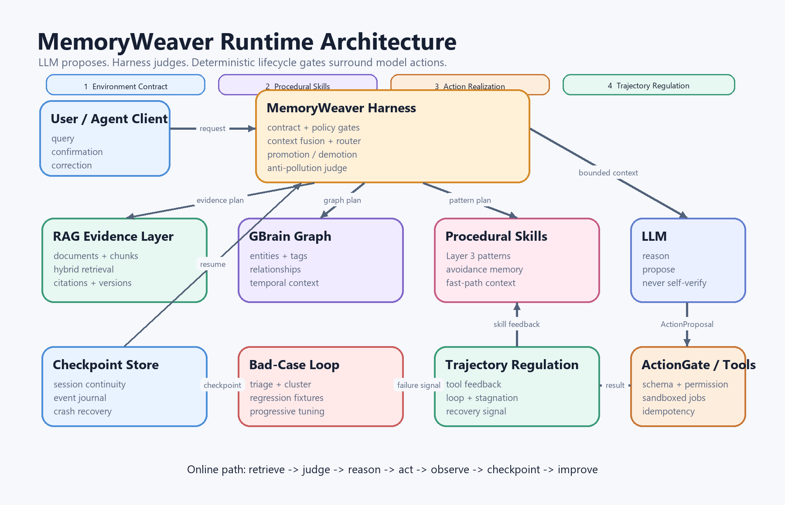

# MemoryWeaver

[中文版 (Chinese Version)](README_ZH.md) | [GitHub](https://github.com/Invovel/weaver-memory)

**Feedback-Calibrated Memory Harness for Long-Lived AI Agents**

**LLM proposes. Harness judges.**

MemoryWeaver is an experimental memory harness for AI agents that turns conversations, terminal outputs, tool results, user corrections, and task outcomes into reusable long-term memory. Unlike traditional RAG systems, MemoryWeaver uses **source-gated polarity** and **contradiction detection** to prevent LLM fabrications from polluting the memory store.

Unlike traditional RAG systems that only retrieve documents, MemoryWeaver focuses on **feedback-aware memory evolution**:

* What worked?
* What failed?
* What was neutral context?
* What is still uncertain?
* Which memory patterns should be promoted, deprecated, linked, or reused?
* Which tags are useful for a specific LLM or agent workflow?

The goal is to help AI agents move from:

```text
Ask → Retrieve → Answer
```

to:

```text
Act → Observe → Learn → Remember → Reuse → Improve
```

---

## Why MemoryWeaver?

Most RAG systems treat memory as static knowledge.

MemoryWeaver treats memory as an evolving feedback system.

It is designed for long-running agents that need to remember:

* Project setup
* Terminal errors
* Successful fixes
* Failed attempts
* User corrections
* User preferences
* Tool usage history
* Model-specific memory formats
* Outdated or invalid assumptions
* Reusable diagnostic patterns

This is especially useful for:

* Coding agents
* Vibe coding workflows
* AI developer assistants
* Technical support agents
* Internal knowledge agents
* Research assistants
* Long-term personal AI assistants

---

## Core Idea

MemoryWeaver uses a layered memory architecture.

```text
User / Tool / Terminal Event
        ↓
Harness Pre-Tagging
        ↓
Layer 1: Candidate Memory
        ↓
Layer 2: Activated / Validated Memory
        ↓
Graph Linking / Pattern Composition
        ↓
Layer 3: Shared Pattern Memory
        ↓
Harness Policy Update
```

The system is designed as a feedback loop:

```text
Tag → Use → Feedback → Promote → Link → Abstract → Retag
```

---

## Memory Layers

### Layer 1: Candidate Memory

The harness performs initial lightweight tagging.

This layer stores raw memory candidates before they are proven useful.

Examples:

```text
positive?
negative?
neutral?
ambiguous?
```

At this stage, the system does not assume the memory is correct or reusable.

---

### Layer 2: Activated Memory

A memory enters Layer 2 when it has been:

* Retrieved
* Used in a response
* Connected to a task
* Confirmed or corrected by the user
* Verified by a tool or terminal result

Layer 2 separates memory into quality partitions:

```text
positive   → useful or successful signals
negative   → failed paths or wrong assumptions
neutral    → stable context or background facts
ambiguous  → unverified hypotheses
```

---

### Layer 3: Shared Pattern Memory

Layer 3 stores reusable patterns, not just raw tags.

A pattern may combine multiple memory signals:

```text
positive + negative + neutral + ambiguous
```

Example:

```text
If Codex CLI is installed successfully in WSL,
but subscription loading still fails,
do not prioritize npm reinstall.
Check authentication, selected organization, or subscription state first.
```

Layer 3 is shared by the harness and retrieval system.

It helps the agent decide:

* When to use fast mode
* When to use thinking mode
* Which memory to retrieve
* Which assumptions to avoid
* Which tool path to try first
* Which model-specific memory format to use

---

## Memory Polarity

MemoryWeaver classifies memory into four major polarity zones.

### Positive Memory

Useful, successful, or validated knowledge.

Examples:

* A command worked
* A fix solved the issue
* The user confirmed the answer
* A tool result verified the assumption

### Negative Memory

Failed attempts, wrong assumptions, or rejected paths.

Examples:

* The user corrected the assistant
* A command failed
* A proposed fix did not work
* A previous assumption was misleading

Negative memory is not deleted. It becomes **avoidance memory**.

### Neutral Memory

Stable facts or background context.

Examples:

* User uses WSL
* Project uses pnpm
* Agent is working inside a Next.js repository
* User prefers step-by-step explanations

### Ambiguous Memory

Unverified hypotheses.

Examples:

* The issue may be caused by organization selection
* The package version might be incompatible
* The tool may require additional authentication

Ambiguous memory can later become positive, negative, or deprecated.

---

## Harness Role

MemoryWeaver treats the harness as the control layer.

The harness is responsible for:

* Detecting memory-worthy events
* Pre-tagging user and tool interactions
* Classifying feedback
* Tracking successful and failed paths
* Scoring memory value
* Routing memory into layers
* Updating heat, confidence, and freshness
* Promoting or deprecating memory
* Selecting fast mode or thinking mode
* Learning which tags are useful for each LLM

The LLM reasons.
The tools act.
The memory stores.
The harness coordinates.

MemoryWeaver is evolving from a memory harness into a lifecycle-aware runtime
harness: calibrate environment contracts before interaction, retrieve
procedural skills during task conditioning, validate actions before execution,
and regulate degraded trajectories after feedback. This direction is inspired
by [LIFE-HARNESS](https://arxiv.org/abs/2605.22166); see
[`docs/life_harness_notes.md`](docs/life_harness_notes.md).

---

## Fast Mode vs Thinking Mode

MemoryWeaver supports adaptive inference routing.

```text
New / uncertain / high-risk task
        → Thinking Mode

Similar / validated / low-risk task
        → Fast Mode

Known but possibly outdated task
        → Fast + Verify
```

This allows agents to think deeply once, archive the result, and reuse validated patterns later.

---

## GBrain / Graph Memory Integration

MemoryWeaver is designed to work with graph-style memory systems.

Graph memory can:

* Link related tags
* Merge duplicate nodes
* Detect stale knowledge
* Connect people, projects, errors, tools, and outcomes
* Compose second-layer signals into third-layer patterns

Example:

```text
WSL
+ Codex CLI
+ npm global install success
+ subscription load failed
+ user already has API key
```

can become:

```text
Codex CLI authentication/subscription diagnostic pattern
```

---

## Suggested Memory Schema

```json
{
  "id": "mem_xxx",
  "layer": 1,
  "polarity": "positive | negative | neutral | ambiguous",
  "memory_type": "fact | correction | success_path | failed_attempt | preference | hypothesis | pattern | avoidance_rule",
  "content": "...",
  "tags": ["..."],
  "linked_tags": ["..."],
  "source": "user | assistant | terminal | tool | file | web",
  "evidence": "...",
  "scope": "global | user | project | session | model",
  "model_fit": ["fast-chat", "reasoning-model", "coding-agent"],
  "confidence": 0.0,
  "heat": 0,
  "success_score": 0.0,
  "correction_score": 0.0,
  "freshness": "stable | volatile | expired | unknown",
  "status": "candidate | activated | promoted | deprecated | archived"
}
```

---

## Example Pattern Schema

```json
{
  "id": "pattern_xxx",
  "layer": 3,
  "pattern_type": "diagnostic_rule",
  "composed_from": [
    "mem_positive_1",
    "mem_negative_2",
    "mem_neutral_3",
    "mem_ambiguous_4"
  ],
  "rule": "If X and Y are true, prioritize Z and avoid A.",
  "applies_when": ["..."],
  "avoid_when": ["..."],
  "confidence": 0.82,
  "model_fit": ["coding-agent"],
  "promotion_reason": "Repeatedly helped solve similar tasks"
}
```

---

## Source-Gated Anti-Pollution

MemoryWeaver uses three layers of defense to prevent LLM fabrications from contaminating memory:

### 1. Source-Gated Polarity

Every memory has a `source` field. Assistant-generated content is **always** classified as `ambiguous` and never automatically trusted:

| Source | Allowed Polarity | Rationale |
|--------|-----------------|-----------|
| `user` | positive, negative, neutral, ambiguous | Direct human feedback |
| `terminal` | positive, negative, neutral | Objective command results |
| `tool` | positive, negative, neutral | Tool outputs are verifiable |
| `assistant` | **ambiguous only** | LLM output is unverified by default |
| `composer` | neutral, ambiguous | Pattern composition is inferred |

An ambiguous memory can only be upgraded to `positive` or `negative` through external verification (user confirmation or terminal validation).

### 2. Contradiction Detection

When a new memory conflicts with existing verified knowledge, a three-tier severity system determines the response:

```
L1 (SILENT) — both claims are unverified → record, don't interrupt
L2 (WARN)   — unverified vs possibly-stale verified → note, proceed cautiously
L3 (BLOCK)  — verified fact or user preference contradicted → stop, ask user
```

The `ContradictionResolver` (`memoryweaver/contradiction.py`) implements this with a priority rule chain that treats user preferences and terminal-verified facts as the highest authority.

### 3. Verified Retrieval

The `VerifiedRetriever` (`memoryweaver/retriever.py`) filters memories by source credibility during retrieval:

- User and terminal sources always pass through
- Web and composer sources pass with confidence check
- **Assistant-sourced memories with zero heat are excluded entirely**
- Assistant memories with heat > 0 can be included only when explicitly requested

This prevents the self-pollution loop: `LLM fabricates → stored as memory → retrieved next time → reinforces fabrication`.

### Architecture Diagram



This is the target runtime architecture. The current Sprint 0 prototype
implements the local memory core and the first anti-pollution primitives.
RAG, GBrain, checkpoint recovery, CLI job isolation, and the bad-case loop are
planned boundaries documented under [`docs/`](docs/).

---

## Current Structure

```text
memoryweaver/
├── memoryweaver/
│   ├── __init__.py
│   ├── schema.py          # MemoryItem, Pattern, enums
│   ├── store.py           # JSON-backed MemoryStore
│   ├── scorer.py          # Heat, confidence, promotion
│   ├── extractor.py       # EventDetector + FeedbackClassifier (zh/en)
│   ├── router.py          # Fast / Thinking / Fast-Verify mode router
│   ├── retriever.py       # VerifiedRetriever with source-aware weighting
│   └── contradiction.py   # ContradictionResolver (SILENT/WARN/BLOCK)
│
├── examples/
│   └── basic_memory_loop.py
│
├── benchmarks/
│   └── prototype_baseline.py
│
├── scripts/
│   └── generate_architecture_diagram.py
│
├── docs/
│   ├── architecture.md
│   ├── life_harness_notes.md
│   ├── development_plan.md
│   ├── rag_evidence_layer.md
│   ├── gbrain_graph_memory.md
│   ├── react_agent_runtime.md
│   ├── bad_case_learning_loop.md
│   ├── agent_test_catalog.md
│   ├── testing_resilience_strategy.md
│   └── risk_assessment_and_benchmark.md
│
└── tests/
    ├── test_schema.py
    ├── test_contradiction.py
    └── test_retriever.py
```

---

## Design Documents

- [`docs/architecture.md`](docs/architecture.md) — system boundaries and design principles
- [`docs/life_harness_notes.md`](docs/life_harness_notes.md) — lifecycle gates inspired by LIFE-HARNESS
- [`docs/rag_evidence_layer.md`](docs/rag_evidence_layer.md) — high-performance evidence retrieval
- [`docs/gbrain_graph_memory.md`](docs/gbrain_graph_memory.md) — graph memory, tags, and memory lifecycle
- [`docs/react_agent_runtime.md`](docs/react_agent_runtime.md) — ReAct runtime, session continuity, cache governance, and capacity planning
- [`docs/bad_case_learning_loop.md`](docs/bad_case_learning_loop.md) — bad-case collection and progressive optimization
- [`docs/testing_resilience_strategy.md`](docs/testing_resilience_strategy.md) — regression, crash, avalanche, stress, security, and A/B testing
- [`docs/risk_assessment_and_benchmark.md`](docs/risk_assessment_and_benchmark.md) — current risks and measured prototype baseline

---

## Prototype Benchmark

Run the reproducible local baseline:

```powershell
python .\benchmarks\prototype_baseline.py
```

Measured on Windows 11 with Python 3.14.0:

| Memory items | JSON size | Write throughput | Verified text search p95 |
| ---: | ---: | ---: | ---: |
| 100 | 75 KB | 266.08 items/s | 0.27 ms |
| 500 | 378 KB | 81.57 items/s | 1.46 ms |
| 1,000 | 756 KB | 44.96 items/s | 2.91 ms |

The JSON prototype is suitable for semantics and regression work, not
production-scale ingestion. Each write rewrites the JSON file.

---

## Roadmap

### Phase 0: Concept Prototype

* Define memory schema
* Define polarity partitions
* Build local JSON-based memory store
* Implement manual memory tagging
* Build simple retrieval by tags and text

### Phase 1: Harness MVP

* Event detector
* Feedback classifier
* Memory scorer
* Layer 1 → Layer 2 promotion
* Fast / thinking mode router
* Terminal output ingestion

### Phase 2: RAG Integration

* Add vector database
* Add embedding-based retrieval
* Add memory heat and decay
* Add freshness and confidence scoring
* Add memory conflict detection

### Phase 3: Graph Memory

* Add graph linking
* Compose `positive + negative + neutral + ambiguous` into patterns
* Add stale node detection
* Add pattern promotion into Layer 3

### Phase 4: Agent Integration

* Add LangGraph adapter
* Add MCP interface
* Add coding-agent example
* Add terminal tool memory loop
* Add model-specific memory profiles

### Phase 5: Evaluation

* Measure retrieval usefulness
* Track repeated error reduction
* Track user correction rate
* Track task resolution rate
* Compare memory-enabled vs memory-disabled agent runs

---

## Use Cases

### Coding Agent Memory

Remember project-specific commands, environment constraints, failed fixes, and successful solutions.

### Technical Support Agent

Turn solved tickets into diagnostic patterns and failed attempts into avoidance rules.

### Research Assistant

Track hypotheses, evidence, contradictions, and evolving conclusions.

### Personal AI Assistant

Remember user preferences, long-term goals, project context, and communication style.

### Multi-Agent Memory Layer

Provide shared, structured memory across different LLMs and tools.

---

## Design Principles

1. Memory should be evidence-backed.
2. Negative memory is useful.
3. Ambiguous memory should not be treated as truth.
4. Memory must decay or expire.
5. Repeated usefulness should promote memory.
6. Graph links are more powerful than isolated tags.
7. The harness should learn from memory feedback.
8. Different models may need different memory formats.
9. Long-term memory should be inspectable and editable.
10. Agents should remember outcomes, not just text.

---

## Status

**Sprint 0 prototype complete.** Core modules are implemented with 68 passing
tests:

- `schema.py` — MemoryItem dataclass (4 polarities, 3 layers, 5 statuses)
- `store.py` — Atomic JSON-backed CRUD with tag/polarity/layer queries
- `scorer.py` — Heat/confidence scoring and layer promotion rules
- `extractor.py` — Bilingual feedback classifier (zh/en) + event detector
- `router.py` — Fast / Thinking / Fast-Verify mode routing
- `retriever.py` — Source-aware verified retrieval with anti-pollution filtering
- `contradiction.py` — Three-tier contradiction resolver (SILENT / WARN / BLOCK)

The next milestone is **Sprint 0.1 hardening**. The benchmark currently records
six known gaps:

1. The declared `mw = memoryweaver.cli:main` entry point has no `cli.py`.
2. Plain updates incorrectly increase heat.
3. Tag retrieval can bypass the assistant source gate.
4. Assistant memories can be constructed directly as positive and high-confidence.
5. `ModeRouter` can use an unverified assistant Pattern for the fast path.
6. Whitespace tokenization misses reordered Chinese queries.

Next: close the trust boundary, add regression fixtures for these bad cases,
then implement checkpoint recovery, minimal GBrain projection, bounded ReAct,
and the RAG evidence layer incrementally.

---

## License

MIT

---

## Acknowledgements

This project is inspired by ideas from:

* RAG systems
* Long-term agent memory
* Feedback loops
* Knowledge graphs
* Cognitive architectures
* Vibe coding agents
* Memory-first agent frameworks

MemoryWeaver is not intended to replace existing agent frameworks.
It is designed to sit between the agent harness, memory store, graph layer, and retrieval layer.
