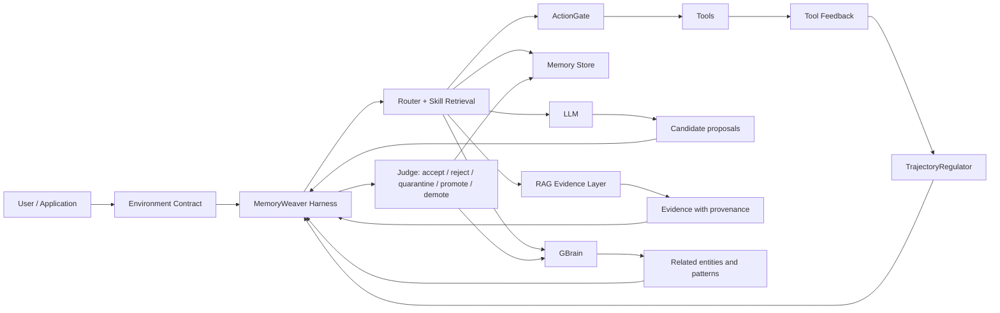
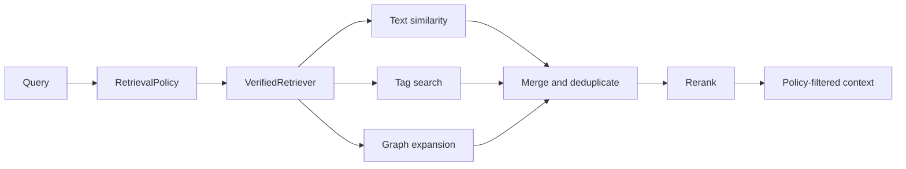
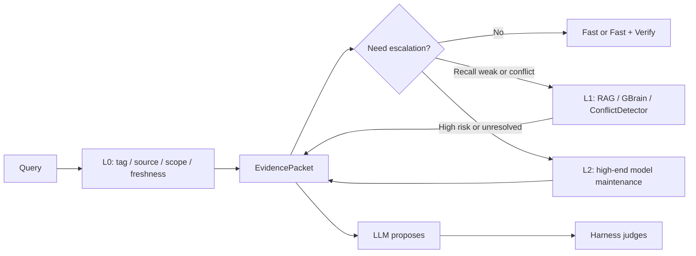

# MemoryWeaver Architecture

## 文档状态

本文描述当前实现与后续目标架构。标记为“目标”的组件尚未落地，不应被
README 或调用方当作已有能力。

## 核心原则

**LLM proposes, Harness judges.**

- LLM 只能提出候选记忆、候选 Pattern、检索扩展词和行动建议。
- LLM 输出不能直接写入 verified memory。
- `assistant` 来源默认只能进入 `ambiguous`。
- HyDE 输出属于 `synthetic` 检索辅助文本，不是事实证据。
- negative memory 是 avoidance memory，不是应被丢弃的垃圾。
- Layer 3 存 Pattern，不直接存 raw chunk，且默认 `provisional`。
- RAG 负责证据检索，GBrain 负责关系图谱。
- MemoryWeaver Harness 负责判断、调度、晋升、降权和防污染。
- Harness 还负责执行前动作校验和执行后轨迹调节。
- LLM 可以维护候选图谱、候选摘要和候选分支，但不能直接维护 verified memory
  或 stable Pattern。

## 总体流程

## 组件职责

| 组件 | 负责 | 不负责 |
| --- | --- | --- |
| Harness | 校验、调度、晋升、降权、防污染、冲突处置、动作校验、轨迹恢复 | 因为 LLM 输出流畅就直接信任 |
| LLM | 推理、候选记忆、候选 Pattern、查询扩展 | 直接写 verified memory |
| Memory Store | 保存记忆、生命周期、来源、效用信号 | 把编辑次数当成成功使用次数 |
| GBrain | 实体、记忆、Pattern、证据之间的关系 | 替代 RAG 证据检索 |
| RAG Evidence Layer | 清洗、分块、索引、召回、重排、引用 | 把 synthetic 文本晋升为事实 |
| Router | 在策略约束下选择 fast / thinking / fast+verify | 绕过 Harness 或 RetrievalPolicy |
| Environment Contract | 明确工具 schema、权限、source authority 与环境约束 | 允许模型自行发明规则 |
| ActionGate | 在执行前校验参数、权限、危险操作、幂等和确认要求 | 用第二个 LLM 替代确定性校验 |
| TrajectoryRegulator | 检测重复失败、停滞、预算耗尽和恢复条件 | 无限重试或偷偷执行高风险 fallback |
| Tool Feedback | 提供结构化、可验证的执行结果 | 未经 Harness 判断直接成为 verified memory |

## 当前实现

当前仓库已实现 SDK v0.2.0 JSON 原型：

| 文件 | 当前能力 |
| --- | --- |
| `memoryweaver/schema.py` | Layer 1/2 `MemoryItem`、canonical `Pattern`、`Source` enum 与生命周期信号 |
| `memoryweaver/store.py` | JSON 持久化、`MemoryWorkspace`、CRUD、tag / polarity / layer / status 查询、中文与中英混合 lexical 相似度 |
| `memoryweaver/policy.py` | `MemoryPolicy`、`RetrievalPolicy` 与来源/状态/scope gate |
| `memoryweaver/evidence.py` | `EvidenceNode`、`EvidenceLink`、`EvidencePacket` 与证据持久化 |
| `memoryweaver/composer.py` | `PatternStore` 与显式 provisional `PatternComposer` |
| `memoryweaver/graph_schema.py` | 最小 Graph node、edge、proposal schema |
| `memoryweaver/graph_store.py` | JSON-backed candidate graph store |
| `memoryweaver/graph_linker.py` | 手动 / 规则式 tag-memory-evidence-pattern 边建立 |
| `memoryweaver/graph_retriever.py` | 一跳 tag expansion 与 graph candidate narrowing |
| `memoryweaver/config.py` | 可选 LLM graph proposal 配置，默认关闭 |
| `memoryweaver/providers/` | OpenAI / Anthropic / DeepSeek / Qwen / local provider skeletons |
| `memoryweaver/graph/` | `LLMGraphProposalService`、review policy、reviewed linker |
| `memoryweaver/cli.py` | `mw validate`、memory、evidence、pattern、route |
| `memoryweaver/scorer.py` | access、use、validation、success、correction、confidence；不自动创建 Layer 3 |
| `memoryweaver/extractor.py` | 中英文规则式 feedback 分类与事件检测 |
| `memoryweaver/router.py` | 消费 policy-filtered memory 与 canonical Pattern 的 fast / thinking / fast+verify 路由 |
| `memoryweaver/retriever.py` | source-aware 文本与 tag 检索、status gate、synthetic 隔离 |
| `memoryweaver/contradiction.py` | 已知冲突对的 SILENT / WARN / BLOCK 处置 |

## 当前缺口

以下能力尚未落地：

- Harness 主入口与端到端判断链。
- 自动发现冲突候选的 `ConflictDetector`。
- `EnvironmentContract`、`ToolContract` 与 source authority。
- 结构化 `ActionProposal`、`ActionGate` 与 `ActionPolicy`。
- `TrajectoryRegulator`：重复、停滞、预算与恢复策略。
- GBrain 图谱存储与关系查询。
- 多跳图谱 expansion、alias merge、temporal graph 和 graph maintenance。
- RAG 证据层、向量数据库、Hybrid Retrieval 与 rerank。

P0 source gate、tag gate、Router gate 与 heat 生命周期拆分已通过五轮验证，详见
[P0 trust-boundary report](./validation/p0-trust-boundary-2026-06-02/README.md)。

ReAct 在线循环、CLI job queue、会话 checkpoint、缓存治理和容量规划见
[react_agent_runtime.md](./react_agent_runtime.md)。

GBrain 图谱节点、Layer 2 tag 投影、短中长期 memory 映射和快速回退阶梯见
[gbrain_graph_memory.md](./gbrain_graph_memory.md)。

生命周期 Harness、权限等级和 LIFE-HARNESS 映射见
[life_harness_notes.md](./life_harness_notes.md)。

## 生命周期介入点

借鉴 LIFE-HARNESS，但不直接复制其 benchmark runtime。MemoryWeaver 的目标介入点：

| 阶段 | Harness 介入 |
| --- | --- |
| 交互前 | 加载环境合同、工具约束、来源权威和检索策略 |
| 任务条件化 | 检索 Layer 3 procedural skill、GBrain 上下文和 RAG evidence |
| 执行前 | `ActionGate` 校验结构、权限、风险、幂等和用户确认 |
| 执行后 | `TrajectoryRegulator` 检测重复失败、停滞、超时和预算耗尽 |
| 任务完成后 | 记录候选记忆、bad case、效用和回归 fixture |

优先使用确定性 gate。LLM 可提出候选规则、技能和恢复路径，但不能绕过 gate。

## 记忆层

| 层级 | 用途 | 内容 |
| --- | --- | --- |
| Layer 1 | 候选记忆 | 用户、工具、终端、assistant 提出的待判断信息 |
| Layer 2 | 激活 / 验证记忆 | 经过外部证据或任务结果支持的可复用记忆 |
| Layer 3 | Pattern | 从多条记忆与证据组合出的可复用规则 |

raw chunk 属于 RAG Evidence Layer。Layer 3 只保存 Pattern，并通过 provenance
链接回 supporting memories 与证据。

当前 SDK 规则：

- 新 `MemoryItem` 只允许 Layer 1 / Layer 2。
- 旧 JSON 中的 Layer-3 `MemoryItem` 仅作为 legacy 读取，并在 validate 中警告。
- `PatternComposer` 是创建 Layer-3 Pattern 的唯一入口。
- Layer 3 is provisional by default.
- `stable` Pattern 必须显式验证，不后台晋升、不自动泛化。
- LLM 维护的 GBrain、思维导图或分支存储只能作为 candidate structure，由 Harness
  和 policy gate 判断后才能影响 verified memory 或 stable Pattern。

## 来源模型

目标实现应使用 `Source` enum，而不是裸字符串：

| Source | 默认处理 |
| --- | --- |
| `USER` | 候选输入，按策略判断是否可晋升 |
| `ASSISTANT` | 强制 `ambiguous`，不得自动 verified |
| `TERMINAL` | 可验证观察，保留执行上下文 |
| `TOOL` | 可验证观察，校验工具与参数 |
| `FILE` | 带路径、版本或 hash 的证据 |
| `WEB` | 带 URL、时间戳与版本的外部证据 |
| `COMPOSER` | 推断出的候选 Pattern |
| `SYNTHETIC` | HyDE 等合成文本，只用于检索 |

## 检索边界

所有公开检索入口都应进入统一的策略门：

当前 `MemoryStore` 的原始查询可保留为内部能力，但 Router、示例和未来 Agent
adapter 不应直接调用它们。

## 生命周期信号

当前原型已经拆分：

- `updated_at`：内容或元数据发生变化。
- `accessed_at`：记忆被检索。
- `used_at`：记忆参与了行动。
- `validated_at`：结果被用户、工具或终端证据确认。
- `heat`：按策略统计检索或有效使用，不因普通编辑自动上升。

后续 Policy 层还应加入：

- `positive_utility`：使用后帮助成功的证据。
- `avoidance_utility`：阻止已知失败路径的价值。

`confidence` 表示可信度，不应把 positive utility 与 negative avoidance
压缩成一个互相抵消的比例。

## Collaborative Specialist Routing

后续 Router 应逐级调用 specialist，而不是一次拉起所有昂贵能力：

该设计参考 [GSCo / MedDr](https://github.com/sunanhe/MedDr) 的
generalist-specialist collaboration，但 MemoryWeaver 的 specialist 输出只能进入
结构化 `EvidencePacket`。LLM 和 specialist 都不能直接写 verified memory。

完整设计、开源项目组合与 benchmark 指标见
[collaborative_specialist_routing.md](./collaborative_specialist_routing.md)。
