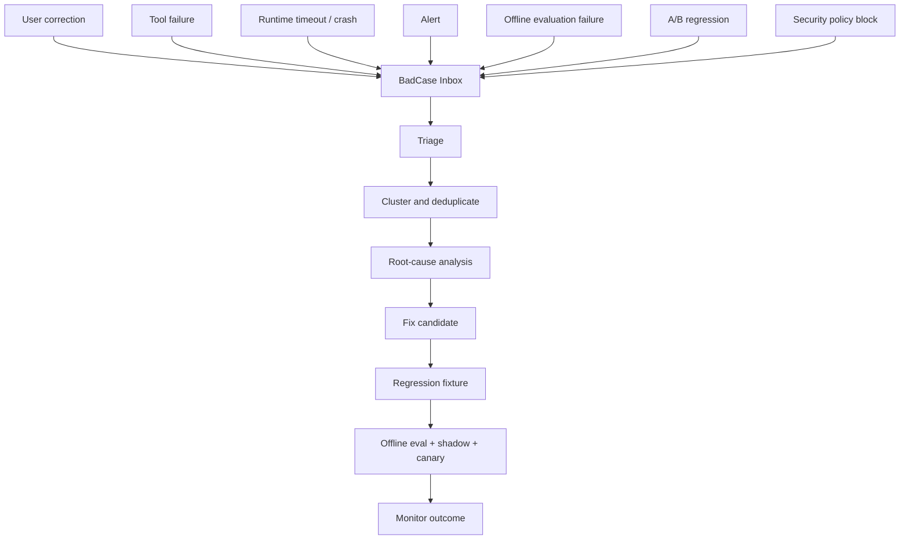
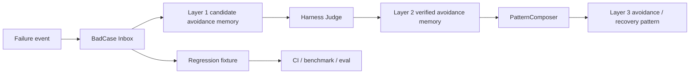

# Bad-Case Learning Loop

## 文档状态

本文定义 MemoryWeaver 如何收集、归纳、修复和验证 bad case。它补充 Layer 1 与
Layer 2 的记忆筛选，但不改变核心原则：

**LLM proposes, Harness judges.**

## 结论

第一层 candidate 与第二层 activated / verified 的筛选方向是正确的，但还不足以形成
持续优化闭环。

Layer 1 和 Layer 2 回答：

- 这条信息是否值得保存？
- 它是否有来源和外部证据？
- 它是否可以被复用？

bad-case 系统还要回答：

- 失败发生在哪个运行阶段？
- 是否可复现？
- 是单点问题、系统性问题还是新类型问题？
- 应该修 Prompt、policy、retrieval、graph、tool、runtime 还是数据？
- 修复后哪些回归用例必须永久保留？
- 修复是否真的降低了线上失败率？

## Bad Case 不是普通 negative memory

negative memory 是 avoidance memory，可以告诉 Agent 避免某条已知失败路径。

bad case 是带有诊断上下文的失败样本，面向工程优化。一个 bad case 可以生成：

- Layer 1 candidate memory。
- Layer 2 avoidance memory。
- Layer 3 Pattern。
- regression fixture。
- RAG / GBrain 数据修复任务。
- Prompt、policy、tool 或 runtime 变更。
- 监控告警和发布门禁。

## BadCase Schema

```json
{
  "id": "badcase_xxx",
  "occurred_at": "2026-06-01T00:00:00Z",
  "tenant_id": "tenant_xxx",
  "project_id": "project_xxx",
  "thread_id": "thread_xxx",
  "checkpoint_id": "ckpt_xxx",
  "stage": "retrieval | graph | routing | reasoning | tool | checkpoint | safety",
  "category": "pollution | hallucination | missed_recall | wrong_fast_path | timeout | duplicate_side_effect | authorization | cost_spike | other",
  "severity": "s0 | s1 | s2 | s3",
  "symptom": "...",
  "expected": "...",
  "actual": "...",
  "input_ref": "...",
  "output_ref": "...",
  "evidence_refs": [],
  "memory_refs": [],
  "graph_refs": [],
  "tool_job_refs": [],
  "policy_version": "policy-v1",
  "rag_snapshot": "rag-snapshot-x",
  "graph_snapshot": "graph-snapshot-x",
  "model_profile": "model-x",
  "reproducible": null,
  "root_cause": null,
  "status": "new | triaged | clustered | fixed | verified | monitored | archived",
  "regression_case_id": null
}
```

原始输入、工具输出、日志和文档可能包含隐私或 secret。`BadCase` 默认保存引用，不
直接复制敏感正文。

## 数据入口



## 失败分类

| 类别 | 例子 | 优先修复位置 |
| --- | --- | --- |
| Pollution | assistant 或 HyDE 进入 verified memory | `MemoryPolicy` |
| Wrong fast path | 未验证 Pattern 触发 fast | `RetrievalPolicy`、Router |
| Missed recall | 中文查询召回为 0 | tokenizer、Hybrid Retrieval |
| Wrong evidence | 引用不支持结论 | reranker、citation validator |
| Graph error | alias 环、错误 edge、过期关系 | `GraphProjector`、stale detection |
| Hallucination | 无证据仍给确定答案 | Harness、answer policy |
| Tool misuse | 工具选错、参数错、重复副作用 | ToolGateway、idempotency |
| Runtime failure | OOM、超时、队列积压 | bounded loop、bulkhead、checkpoint |
| Security | 越权、prompt injection、secret 泄漏 | sandbox、authorization、redaction |
| Cost spike | 大模型过用、循环调用、检索过量 | budget、router、alerts |

## Layer 1、Layer 2 与 Bad Case 的关系



规则：

1. 失败事件可以进入 BadCase Inbox，但不自动写 verified memory。
2. user correction、terminal result 和 tool result 可作为外部证据。
3. assistant reflection 只能提出 root-cause 候选。
4. negative memory 的价值用 `avoidance_utility` 表达，不用低 confidence 表达。
5. 同一失败模式重复出现时，优先聚类并生成 Pattern，不无限堆积重复记忆。

## 归纳与聚类

聚类键建议分层生成：

| 层级 | 键 |
| --- | --- |
| 精确键 | error code、exception type、tool name、command fingerprint |
| 语义键 | normalized symptom、intent、project scope、environment |
| 图谱键 | related entity、tag、package、version、dependency edge |
| 时序键 | first seen、last seen、release version、snapshot |

输出：

- `cluster_id`
- 出现次数、受影响 tenant / project 数量
- 首次和最近发生时间
- 复现率
- severity
- 已知 workaround
- supporting evidence
- regression fixture
- 是否已经有 Layer 2 avoidance memory 或 Layer 3 Pattern

## 递进优化闭环

```text
Observe
  -> Record BadCase
  -> Triage
  -> Reproduce
  -> Cluster
  -> Root-cause candidate
  -> Fix
  -> Add regression fixture
  -> Run offline eval and benchmark
  -> Shadow
  -> Canary
  -> A/B when appropriate
  -> Monitor
  -> Promote avoidance memory or Pattern
```

每次修复至少留下：

1. 一个可复现 fixture。
2. 一个防回退断言。
3. 一个归属组件。
4. 一个监控指标或告警条件。
5. 一个验证结果。

## Bad-Case Metrics

| 指标 | 用途 |
| --- | --- |
| bad cases / 1k turns | 总体失败密度 |
| repeat bad-case rate | 同类问题是否反复发生 |
| time to triage | 发现到归类 |
| time to reproduce | 能否快速复现 |
| time to fix | 修复速度 |
| regression recurrence rate | 修复后是否复发 |
| pollution rate | 错误记忆污染率 |
| wrong fast-path rate | 快路径误判率 |
| missed-recall rate | 应召回但未召回 |
| duplicate-side-effect count | 崩溃恢复是否安全 |
| unresolved conflict age | 冲突积压 |

## 优先加入 Registry 的当前 Bad Cases

| ID | Bad case | 当前证据 | 应转为 |
| --- | --- | --- | --- |
| `bc-cli-entry-001` | `mw` CLI 指向不存在模块 | import probe 失败 | CLI regression |
| `bc-heat-update-001` | 普通 update 增加 heat | benchmark probe: `1` | lifecycle regression |
| `bc-tag-gate-001` | tag search 返回未验证 assistant | benchmark probe: `true` | anti-pollution regression |
| `bc-assistant-positive-001` | assistant 可直接 positive | benchmark probe: `true` | schema / policy regression |
| `bc-router-bypass-001` | 未验证 assistant Pattern 触发 fast | benchmark probe: `fast` | Router regression |
| `bc-zh-recall-001` | 中文重排短句召回失败 | benchmark probe: `0` | retrieval regression |

## 最小落地顺序

1. 先把上表 6 个已知 bad case 固化成 pytest。
2. 增加 `BadCase` schema 和 append-only registry。
3. 把 user correction、tool failure、alert 和 offline eval failure 接入 inbox。
4. 增加 cluster ID 与 dedup。
5. 增加 regression fixture 自动生成候选。
6. 接入 shadow、canary 和线上 recurrence 监控。
7. 再让高端模型辅助生成 root-cause 候选和 Pattern 候选。
