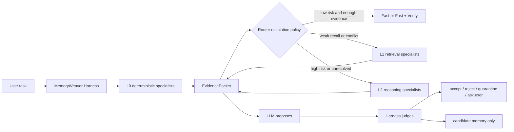

# Collaborative Specialist Routing

## 文档状态

本文是后续实现方案，不代表当前 Sprint 0 原型已经具备多 specialist 调度能力。
方案参考 GSCo，但必须保留 MemoryWeaver 的核心原则：

> **LLM proposes, Harness judges.**

## GSCo 带来的启发

[GSCo / MedDr](https://github.com/sunanhe/MedDr) 将相似病例预测与 specialist
模型预测提供给 generalist，再由 generalist 完成最终推断。论文
[Towards generalizable AI in medicine via Generalist-Specialist Collaboration](https://www.nature.com/articles/s41551-026-01653-3)
发表于 *Nature Biomedical Engineering*，发布日期为 `2026-05-01`。

MemoryWeaver 借用“按需协作”的结构，不照搬最终信任模型：

| GSCo | MemoryWeaver 映射 |
| --- | --- |
| Similar-case diagnoses (`RAD`) | RAG evidence、历史 Memory、Pattern 检索 |
| Specialist predictions (`MOED`) | tag、source、scope、GBrain、ConflictDetector、Tool verifier |
| Generalist MedDr | 主 LLM 推理链 |
| Final diagnosis | Harness 审核后的 action 或 memory decision |

## 目标流程



## Specialist 分层

| 层级 | 默认调用 | 适用条件 | 失败时 |
| --- | --- | --- | --- |
| L0 | canonical tag、source gate、scope、freshness、point lookup | 每次请求 | 升级 L1 |
| L1 | RAG hybrid retrieval、GBrain 1-hop、Pattern lookup、ConflictDetector | 召回不足、信息冲突、需要引用 | 降级到基础 tag / sparse，或升级 L2 |
| L2 | 高端模型、复杂 rerank、离线 PatternComposer、图谱维护建议 | 高风险、复杂冲突、离线维护 | checkpoint、人工确认或安全终止 |

在线链优先短、可解释、可降级。高端模型适合离线维护和困难任务，不应成为所有
请求的同步依赖。

## EvidencePacket

specialist 只返回结构化证据，不直接写 verified memory：

```json
{
  "query_id": "query_xxx",
  "policy_version": "policy_v1",
  "scope": "project",
  "specialists": [
    {
      "name": "graph-local-search",
      "version": "v1",
      "status": "ok",
      "latency_ms": 12.4,
      "claims": [],
      "citations": [],
      "confidence": 0.72,
      "source": "synthetic"
    }
  ],
  "conflicts": [],
  "degraded_components": [],
  "recommended_mode": "fast_verify"
}
```

关键规则：

1. specialist 的自由文本输出默认标记为 `SYNTHETIC` 或 `ASSISTANT`。
2. RAG chunk 保留 URL、路径、版本、时间戳和 hash，不直接成为 Layer 3 Pattern。
3. GBrain expansion 返回关系和 provenance，不自动晋升 tag、edge 或 Pattern。
4. LLM 可以根据 `EvidencePacket` 提出行动和候选记忆。
5. Harness 根据 policy、外部证据、冲突和任务结果决定 accept、reject、quarantine、
   promote 或 demote。

## 与开源项目的组合关系

| 需求 | 优先学习对象 | 采用方式 |
| --- | --- | --- |
| 协作式 specialist 调度 | [GSCo / MedDr](https://github.com/sunanhe/MedDr) | 学习按需注入 specialist 结果；保留 Harness 最终裁决 |
| CLI 检索与 synthesis 分离 | [GBrain](https://github.com/garrytan/gbrain) | 学习 scoped retrieval、source tier、graph signal |
| 时态图谱 | [Graphiti](https://github.com/getzep/graphiti) | 学习 episode lineage、增量更新、temporal edge |
| 图谱 RAG | [Microsoft GraphRAG](https://github.com/microsoft/graphrag) | 学习离线 community summary 与 local/global search |
| 可恢复运行链 | [LangGraph persistence](https://docs.langchain.com/oss/python/langgraph/persistence) | 学习 checkpoint、thread、resume、interrupt |
| 轻量 ReAct | [smolagents](https://github.com/huggingface/smolagents) | 学习 bounded tool loop |
| 模型回退 | [LiteLLM Router](https://docs.litellm.ai/docs/routing) | 学习 retry、cooldown、fallback、circuit breaker |
| typed fallback | [Pydantic AI](https://ai.pydantic.dev/models/overview/#fallbackmodel) | 学习显式模型链配置 |
| 工具边界 | [SWE-agent](https://github.com/SWE-agent/SWE-agent)、[OpenHands](https://github.com/All-Hands-AI/OpenHands) | 学习 ACI、隔离运行与恢复 |

## Benchmark

协作路由不能只看回答正确率。至少记录：

| 类别 | 指标 |
| --- | --- |
| 正确性 | task success、错误晋升率、pollution leakage、fast-path false-positive |
| 协作链 | specialist 数量、L0/L1/L2 升级率、冲突率、degraded fallback rate |
| 检索 | Recall@k、citation coverage、zero-result rate、graph expansion hit rate |
| 性能 | end-to-end p50 / p95 / p99、每个 specialist latency、queue depth |
| 成本 | token、模型调用次数、rerank 次数、图谱查询次数、CLI worker minutes |
| 恢复 | retry、cooldown、checkpoint resume、duplicate side effect |

## 最小实施顺序

1. 保持 P0 source、tag、Router 与 heat 回归门禁。
2. 实现 `MemoryPolicy`、`RetrievalPolicy` 和结构化 `EvidencePacket`。
3. 增加 L0 deterministic specialists，不引入多模型编排。
4. 增加最小 GBrain point lookup、tag lookup 和 1-hop expansion。
5. 接入 RAG evidence，并让 L1 可以独立降级。
6. 增加 bounded ReAct、checkpoint 和 ToolGateway。
7. 最后增加 L2 高端模型维护、shadow、canary 与 rollback。

