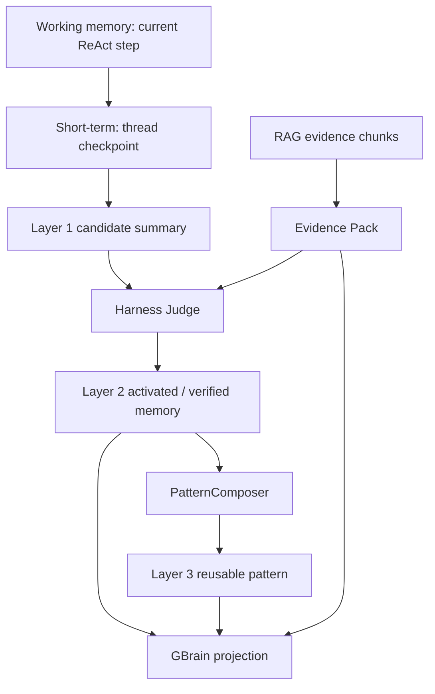
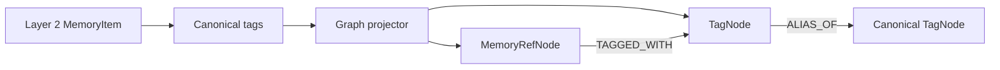
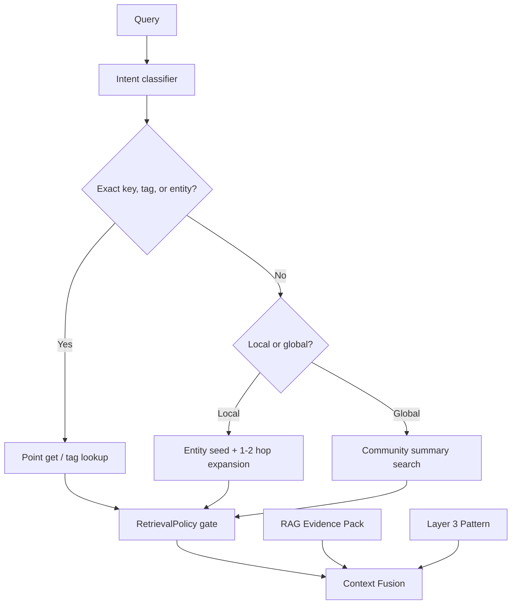

# GBrain Graph Memory And Memory Lifecycle

## 文档状态

本文描述目标 GBrain 架构，不代表当前 Python 原型已经实现。GBrain 负责组织关系，
RAG 负责检索证据，MemoryWeaver Harness 负责判断是否可信、是否可记、是否晋升。

SDK 当前只实现了最小 candidate graph / tag-linking 层，用于一跳 tag expansion、
候选缩小、evidence lineage 和 Pattern lineage。完整 GBrain 数据库、多跳图谱扩展、
alias merge、temporal graph 和自动图谱维护仍是后续目标。

## 先拆开三条轴

短期、中期、长期描述的是**召回范围和保留时间**。Layer 1、2、3 描述的是
**MemoryWeaver 的可信度与抽象层级**。RAG raw document、chunk、Evidence Pack
描述的是**证据处理阶段**。三者不能直接等同。

| 轴 | 层级 | 含义 |
| --- | --- | --- |
| 时间范围 | short / medium / long | 在当前 thread、跨 session、跨项目中保留多久 |
| MemoryWeaver lifecycle | Layer 1 / 2 / 3 | candidate、activated / verified、pattern |
| RAG evidence pipeline | document / chunk / Evidence Pack | 原始资料、可检索块、一次回答使用的证据包 |
| Graph abstraction | episode / entity / tag / edge / community | 来源事件、节点、标签、关系和聚类摘要 |

结论：

- 短期 memory 不应视为 MemoryWeaver Layer 3。
- 短期 memory 可以使用临时 RAG 风格索引，但它仍是 thread-scoped working set。
- Layer 2 可同时包含中期和长期 verified memory。
- Layer 3 是从多条受支持记忆抽象出的长期 Pattern。
- RAG chunk 不能因为被检索到就自动变成 Layer 2 或 Layer 3。
- LLM 可以维护候选图谱、候选摘要和候选分支，但不能直接维护 verified memory
  或 stable Pattern。

## 推荐 memory map

| 时间范围 | 主要内容 | 默认存储 | 晋升方向 |
| --- | --- | --- | --- |
| Working memory | 当前 ReAct step、工具观察、临时变量 | 内存 + Event Journal | checkpoint |
| Short-term memory | 当前 thread 对话、scratchpad、当前 Evidence Pack、未完成 job | Checkpoint Store + 可选 session index | 候选摘要进入 Layer 1 |
| Medium-term memory | 项目决策、已验证环境、近期故障、用户纠正、活跃 tag | Layer 2 Memory Store + GBrain projection | 稳定事实保留；重复经验进入 PatternComposer |
| Long-term memory | 稳定偏好、长期事实、avoidance rule、Pattern、图谱社区 | Layer 2 + Layer 3 + GBrain | freshness 检查、冲突检测、版本替代 |
| Evidence archive | 文档、网页、论文、代码资料和历史 chunk | RAG Store | 只通过引用链接到 memory |



## GBrain 的节点模型

GBrain 不应复制全部 RAG chunk。它保存精选节点、关系和引用：

未来的 LLM 维护流程只能写 candidate graph、candidate mind-map summary 和
candidate branch。所有候选结构必须经过 Harness、MemoryPolicy、RetrievalPolicy、
EvidenceLink 和 Pattern lifecycle gate，才能影响 Layer 2 memory 或 stable Pattern。

| 节点 | 用途 |
| --- | --- |
| `EpisodeNode` | 用户消息、工具反馈、终端结果、文档摄入事件 |
| `MemoryRefNode` | 指向 Layer 2 memory，不复制正文真相 |
| `PatternNode` | 指向 Layer 3 Pattern 与 supporting memories |
| `EntityNode` | 人、项目、工具、包、错误、论文、政策、版本、概念 |
| `TagNode` | 受控 tag、候选 tag、别名和分类路径 |
| `EvidenceRefNode` | 指向 RAG document / chunk / version |
| `CommunityNode` | 离线聚类和全局分类摘要 |

常用关系：

```text
TAGGED_WITH
ALIAS_OF
RELATED_TO
MENTIONED_IN
SUPPORTED_BY
CONTRADICTS
SUPERSEDES
CAUSED_BY
RESOLVED_BY
FAILED_WITH
DERIVED_FROM
APPLIES_TO
MEMBER_OF
```

每条边至少保存：

```json
{
  "edge_id": "edge_xxx",
  "type": "RESOLVED_BY",
  "from_id": "entity_error_xxx",
  "to_id": "memory_fix_xxx",
  "source_refs": ["mem_xxx", "chunk_xxx"],
  "confidence": 0.86,
  "valid_from": "2026-06-01T00:00:00Z",
  "valid_to": null,
  "status": "candidate | active | superseded | deprecated",
  "policy_version": "graph-policy-v1"
}
```

## Layer 2 tag 如何直接存取

Layer 2 memory 自己保留 canonical tags，GBrain 建立可检索投影。不要把 GBrain
变成第二份事实数据库。



写入流程：

1. Harness 验证 Layer 2 memory。
2. `GraphProjector` 用幂等键投影 `MemoryRefNode`。
3. 已存在 canonical tag 直接关联。
4. 新 tag 先写入 `candidate` namespace。
5. 大量重复出现、人工确认或离线分类通过后，再晋升 canonical tag。
6. tag 合并保留 `ALIAS_OF`，不要直接删除旧 tag。

读取流程：

| 查询方式 | 用途 | 是否需要 LLM |
| --- | --- | --- |
| `get_memory(memory_id)` | 精确点取 Layer 2 memory | 否 |
| `get_pattern(pattern_id)` | 精确点取 Layer 3 Pattern 与 lineage | 否 |
| `find_by_tag(tag, scope)` | tag 到 verified memory | 否 |
| `expand_entity(entity_id, depth=1..2)` | 取局部关系 | 否 |
| `find_related_tags(tag)` | tag 扩展、别名和分类路径 | 否 |
| `search_graph(query, focal_node)` | hybrid search + 节点距离重排 | 通常不需要 |
| `search_communities(query)` | 大范围主题分类 | 可使用离线摘要 |

## 检索路由



推荐四条图谱检索路径：

1. **Point Retrieval**：ID、canonical tag、项目、工具、错误码精确取回。
2. **Local Graph Search**：从相关实体出发扩展 1-2 hop。
3. **Temporal Search**：按 `valid_from`、`valid_to`、版本和 supersedes 查询。
4. **Global Community Search**：搜索社区摘要，回答跨文档、跨主题问题。

Point Retrieval 和 Local Graph Search 应优先保持无 LLM、低延迟。大范围分类、社区
摘要和 ontology 演进放到离线维护面。

## 大量搜集与图谱编写

批量文档进入系统时，先进入 RAG Evidence Layer，再由离线流水线生成 GBrain
候选投影：

```mermaid
flowchart LR
    D["Documents / PDF / web / code"] --> R["RAG cleaning + chunking"]
    R --> E["Evidence chunks"]
    E --> EX["Offline entity / tag / relation extraction"]
    EX --> RC["Reconcile aliases and duplicates"]
    RC --> Q["Candidate graph namespace"]
    Q --> EV["Evaluation + policy checks"]
    EV --> W["Versioned GraphWriter"]
    W --> C["Community detection + summaries"]
```



规则：

- raw chunk 永远留在 RAG。
- GBrain 只保存被引用、被验证、被任务使用或对关系有价值的精选节点。
- LLM 抽取出的 tag、entity、edge 默认是 candidate。
- GraphWriter 必须可幂等重放，使用 `source_ref + extractor_version + content_hash`。
- ontology 允许 prescribed types 与 learned candidates 并存。
- 大范围分类应异步执行，不阻塞在线 ReAct。
- 社区摘要是派生缓存，必须可以由节点和关系重建。

## Fast Path 与 ReAct 回退阶梯

“快速回退”不应只理解为模型 API 挂掉以后换模型。它同时包含低成本快路径、
证据不足时升级、依赖故障时降级和长任务转后台。

| Level | 路径 | 典型条件 | 失败后 |
| --- | --- | --- | --- |
| L0 | point get / tag lookup | 已知 ID、错误码、canonical tag | 升级到 L1 |
| L1 | Layer 3 Pattern + local graph | 高 confidence、fresh、低风险 | 升级到 L2 |
| L2 | Fast + Verify | RAG quick evidence check | 升级到 L3 |
| L3 | bounded ReAct | 需要工具、终端或多步判断 | checkpoint 后转 L4 |
| L4 | background deep maintenance | 大规模 RAG / GBrain 更新、复杂研究 | 异步完成后发布候选结果 |

依赖故障时：

| 故障 | 降级策略 |
| --- | --- |
| GBrain 不可用 | 退回 RAG + Layer 2 tag index |
| dense retrieval 不可用 | 退回 sparse / BM25 |
| reranker 不可用 | 使用 hybrid fusion 基础排序 |
| CLI worker 满载 | checkpoint，进入 job queue |
| 主模型超时或限流 | 重试后切 fallback model |
| context 过长 | compact checkpoint，不无限追加历史 |
| confidence 不足 | 升级推理或请求用户确认，不伪造确定答案 |

## 可参考的开源项目与论文

| 参考 | 最适合借鉴 | 不应直接照搬 |
| --- | --- | --- |
| [Graphiti](https://github.com/getzep/graphiti) | 动态 temporal graph、episode provenance、实体与关系、有效期、hybrid search、focal node 检索 | GBrain 仍需符合 MemoryWeaver 的 source gate |
| [Microsoft GraphRAG](https://github.com/microsoft/graphrag) | 文档图谱、local search、global search、community summaries | 它偏离线文档分析，不等于在线 Agent memory |
| [LangGraph memory](https://docs.langchain.com/oss/python/langgraph/add-memory) | thread checkpoint 与跨 thread store 的短长期分离 | 不要把框架 store 直接当 verified memory |
| [LangGraph persistence](https://docs.langchain.com/oss/python/langgraph/persistence) | checkpoint、恢复、human-in-the-loop、durable execution | Harness 仍需自定义 Event Journal 与 policy |
| [LlamaIndex ReAct workflow](https://docs.llamaindex.ai/en/stable/examples/workflow/react_agent/) | 从事件和 step 构建 ReAct loop、tool error、timeout | 示例适合学习，不是生产隔离边界 |
| [smolagents](https://huggingface.co/docs/smolagents/en/conceptual_guides/react) | 小型 ReAct loop、step memory、reset、replay | CodeAgent 执行面必须进入沙箱 |
| [LangChain middleware](https://docs.langchain.com/oss/python/langchain/middleware/built-in) | summarization、模型与工具调用限制、retry、fallback、human-in-the-loop | 作为参考组件，不代替 Harness policy |
| [LiteLLM](https://docs.litellm.ai/) | 多 provider gateway、retry / fallback、额度与可观测性 | 只负责模型网关，不负责记忆正确性 |
| [Pydantic AI FallbackModel](https://ai.pydantic.dev/models/overview/#fallback-model) | Python 中顺序模型回退、异常和语义失败回退 | 不要把模型切换当成事实验证 |
| [Letta / MemGPT](https://docs.letta.com/guides/agents/memory) | in-context core memory 与 external archival memory 分离 | MemoryWeaver 不应让 Agent 自由写 verified memory |
| [Mem0](https://docs.mem0.ai/cookbooks/essentials/choosing-memory-architecture-vector-vs-graph) | 对比完整图谱与轻量 entity linking 的成本 | 当前 OSS 方向已转向 entity linking，需按需求评估 |
| [ReAct paper](https://arxiv.org/abs/2210.03629) | reason / act / observation 交替循环 | 必须加预算、checkpoint 和权限边界 |
| [Reflexion paper](https://arxiv.org/abs/2303.11366) | 从失败反馈生成 episodic reflection | reflection 默认只能是候选 memory |
| [MemGPT paper](https://arxiv.org/abs/2310.08560) | 类操作系统的多级 memory 管理 | 层级概念需映射到本项目策略 |

## 推荐落地顺序

1. 先修复当前 Layer 2 source gate、heat、Router 绕行和中文检索。
2. 增加 `TagDefinition`、canonical tag 与 alias。
3. 增加 `GraphProjector`，只投影 Layer 2 memory 和 Layer 3 Pattern 的引用。
4. 实现 point get、tag lookup 和 1-hop local expansion。
5. 增加 temporal edge、`SUPERSEDES` 和 provenance。
6. 批量 RAG 摄入后，增加 candidate graph namespace。
7. 最后增加 community detection、global summaries 和 ontology 演进。
