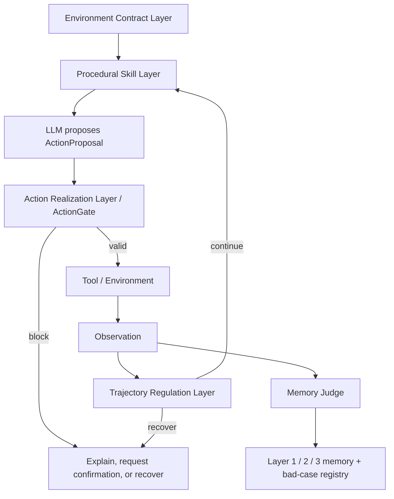

# LIFE-HARNESS Notes For MemoryWeaver

## Source

This document records architectural inspiration from:

- [Adapting the Interface, Not the Model: Runtime Harness Adaptation for Deterministic LLM Agents](https://arxiv.org/abs/2605.22166)
- [Life-Harness reference implementation](https://github.com/Tianshi-Xu/Life-Harness)

The arXiv v2 paper was submitted on 2026-05-26 and revised on 2026-05-27. It
reports evaluation on seven deterministic environments and eighteen model
backbones. The reported average relative improvement is 88.5%, with gains in
116 of 126 model-environment settings.

## What To Borrow

The useful lesson is not “add another model supervisor.” It is:

> Adapt the runtime interface before changing the model.

The paper organizes runtime intervention into four lifecycle layers:

| LIFE-HARNESS layer | MemoryWeaver adaptation |
| --- | --- |
| Environment Contract Layer | `EnvironmentContract`, `ToolContract`, source authority, retrieval policy |
| Procedural Skill Layer | Layer 3 Pattern, avoidance memory, GBrain procedural skill retrieval |
| Action Realization Layer | Structured `ActionProposal`, `ActionGate`, permission and schema validation |
| Trajectory Regulation Layer | `TrajectoryRegulator`, loop detection, stagnation detection, budget handling, recovery |

This mapping is a MemoryWeaver design inference, not a claim made by the paper.

## What Not To Copy Blindly

LIFE-HARNESS focuses on deterministic environments and benchmark agents.
MemoryWeaver also targets long-lived, open-world agents with:

- Long-term memory.
- User preferences and project scope.
- RAG evidence with versions and citations.
- GBrain temporal relationships.
- Human confirmation for risky side effects.
- Privacy, tenant isolation, and deletion requirements.

Therefore MemoryWeaver needs stricter provenance, data lifecycle, authorization,
checkpoint, and bad-case governance.

## Replace The Supervisor With Gates

A monolithic LLM supervisor adds cost, latency, and another source of
hallucination. Use deterministic gates whenever a rule can be expressed
explicitly:

| Gate | Question |
| --- | --- |
| `SourceGate` | May this source enter candidate or verified memory? |
| `TruthGate` | Does evidence support the claim? |
| `RetrievalGate` | May this memory enter context for this query? |
| `FreshnessGate` | Is the fact still valid for the requested time and version? |
| `ConflictGate` | Does the proposal contradict higher-authority memory? |
| `ActionGate` | Is the tool call valid, authorized, safe, and idempotent? |
| `TrajectoryGate` | Is the agent repeating, stalled, over budget, or degrading? |
| `PromotionGate` | Can a candidate become Layer 2 memory or Layer 3 skill? |

An LLM can assist when classification is fuzzy, but its output remains a
proposal.

## Harness Authority Levels

| Level | Authority | Default behavior |
| --- | --- | --- |
| L0 Observe | Read events and results | No mutation |
| L1 Annotate | Add metadata, warnings, and risk labels | Non-blocking |
| L2 Retrieve / Recommend | Select evidence, graph context, and skills | Advisory |
| L3 Validate / Block | Reject invalid, unauthorized, or high-risk actions | Explain block |
| L4 Recover / Force Safe Path | Stop loops, compact state, require confirmation, choose verified fallback | Audit every intervention |

The Harness can stop unsafe behavior. It must not silently take high-risk
actions on the user’s behalf.

## Target Modules

```text
memoryweaver/
  contract.py          # EnvironmentContract, ToolContract, SourceAuthority
  policy.py            # MemoryPolicy, RetrievalPolicy, ActionPolicy
  skill.py             # procedural skill retrieval over Layer 3 patterns
  action_gate.py       # validate ActionProposal before tool execution
  trajectory.py        # repetition, stagnation, budget, recovery
  harness.py           # orchestrate lifecycle intervention points
```

Keep modules small. Introduce them incrementally after closing existing P0
trust-boundary gaps.

## Lifecycle Flow



## Skill Retrieval Is Not Evidence Retrieval

Separate:

| Retrieval path | Retrieves | Good baseline |
| --- | --- | --- |
| Evidence Retrieval | Papers, docs, PDFs, policies, API references | Hybrid sparse + dense + rerank |
| Skill Retrieval | Procedures, command templates, diagnostic patterns, avoidance rules | BM25 / keyword + metadata + graph context |

Procedural skills often contain exact tool names, commands, error codes, and
ordered steps. Sparse retrieval and metadata filters remain valuable even after
dense retrieval is added.

## Minimal Delivery Sequence

1. Fix existing CLI, heat, tag-gate, Router, assistant-source, and Chinese retrieval bad cases.
2. Add `EnvironmentContract` and `ToolContract` schemas.
3. Add structured `ActionProposal` and deterministic `ActionGate`.
4. Add `TrajectoryRegulator` for repetition, stagnation, budget, and recovery.
5. Add checkpoint and Event Journal integration.
6. Add Layer 3 procedural skill retrieval.
7. Add offline LLM-assisted contract and skill proposals behind review, eval, shadow, canary, and rollback.
