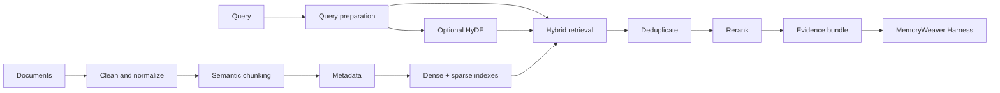

# RAG Evidence Layer

## 定位

RAG 证据层负责检索可引用证据，不负责决定记忆晋升。MemoryWeaver Harness
根据 provenance、策略、冲突和任务反馈判断候选记忆能否成为 verified memory。

## 数据清洗

- 保存原始文本与 normalized text。
- 移除导航、重复页眉页脚、模板噪声和重复段落。
- 保留标题层级、代码块、表格、列表和引用边界。
- 为原文记录 checksum、parser version、cleaner version 和 ingestion timestamp。
- 文档更新时保留旧版本并标记 superseded，不静默覆盖。

## 语义分块

1. 先按标题、段落、列表组、代码块和表格切分。
2. 合并主题连续的短块。
3. 对超长块按 token 限制继续切分并保留 overlap。
4. 保存 parent / child、前后邻居和 heading path。

中文检索不能依赖 whitespace `split()`。第一阶段可用字符 n-gram 或中文 tokenizer
改善 lexical retrieval；dense retrieval 应使用多语言 embedding。

## 元数据

每个 chunk 至少保存：

| 字段 | 用途 |
| --- | --- |
| `chunk_id` | 稳定 chunk 标识 |
| `document_id` | 稳定文档标识 |
| `document_version` | 可复现版本 |
| `content_hash` | 去重与变化检测 |
| `source_uri` | 引用地址 |
| `source_type` | paper、official docs、code、issue、tool output 等 |
| `title` | 可读引用标题 |
| `heading_path` | 原文位置 |
| `language` | tokenizer 与 rerank 策略 |
| `published_at` | 发布日期 |
| `updated_at` | 来源更新时间 |
| `ingested_at` | 入库时间 |
| `valid_from` / `valid_to` | 可选有效期 |
| `parser_version` | 可复现解析 |
| `cleaner_version` | 可复现清洗 |

## 向量库与 HNSW

保留两个互补索引：

- dense vector index：语义召回。
- sparse lexical index：BM25、标识符、精确词和引用锚点召回。

规模增长后使用 HNSW 近似最近邻索引。先用默认配置建立 baseline，再按 Recall@k
与 p95 latency 调整 `M`、`efConstruction` 和查询期 `efSearch`。

## Hybrid Retrieval

推荐查询流程：

1. 规范化 query，识别语言。
2. 生成 dense embedding 候选。
3. 生成 sparse lexical 候选。
4. 可选加入 GBrain 关系扩展词。
5. 可选运行 HyDE 以提高召回。
6. 用 reciprocal rank fusion 等方法融合排序。
7. 按 `content_hash` 和文档谱系去重。
8. 对有限候选集 rerank。
9. 返回包含引用、时间戳、版本和 provenance 的 evidence bundle。

HyDE 文本必须标记为 `SYNTHETIC`。它可以辅助生成检索候选，但不能作为事实引用，
也不能直接写入 verified memory。

## Rerank

可组合以下信号：

- cross-encoder 或 LLM rerank 分数。
- 精确术语和标识符匹配。
- 来源质量。
- freshness 与有效期。
- 引用完整度。
- 重复和 superseded 惩罚。
- GBrain 图距离。

retrieval relevance 与 memory confidence 必须分开。相关不等于真实。

## 论文与来源优先级

默认优先级：

1. 论文、原始研究材料和正式规范。
2. 官方文档与官方发布记录。
3. Maintainer 仓库、release notes 和 issue。
4. 高质量二手来源。
5. 社区讨论，仅作为线索或补充证据。

遇到互相冲突的来源时，应保留双方 provenance，交由 Harness 判断，不要在索引阶段
静默丢弃。

## 性能指标

| 指标 | 用途 |
| --- | --- |
| Recall@k | 有用证据是否进入候选集 |
| nDCG / MRR | 有用证据是否排在前面 |
| p50 / p95 latency | 交互响应性能 |
| Index size | 存储成本 |
| Ingestion throughput | 增量更新能力 |
| Freshness lag | 新证据进入索引的延迟 |
| Citation coverage | 返回结论是否可追溯 |

评估集应分别覆盖中文、英文和中英混合查询。

## 最小落地顺序

1. 定义 document / chunk schema。
2. 实现确定性的清洗与语义分块。
3. 加入 sparse retrieval 与多语言 dense retrieval。
4. 实现 Hybrid Retrieval、去重和 evidence bundle。
5. 加入 rerank。
6. 用基准数据调优 HNSW。
7. 最后加入严格标记为 `SYNTHETIC` 的可选 HyDE。
