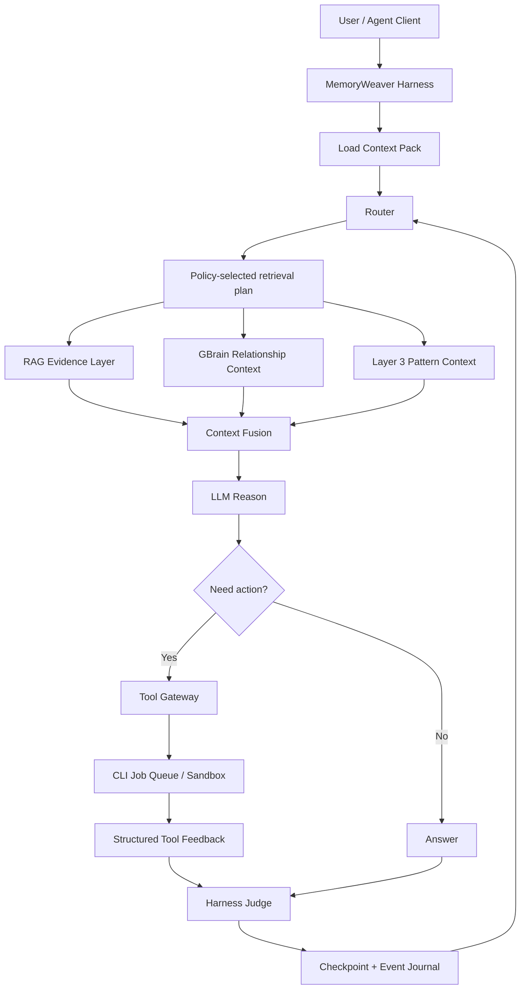

# ReAct Agent Runtime, Session Continuity, And Capacity Planning

## 文档状态

本文描述目标运行时架构，不代表当前 Python 原型已经实现。这里的 `ReAct` 指
Agent 的 **Reason + Act** 循环，不是 React 前端框架。

## 设计目标

MemoryWeaver 不应把每个问题都交给昂贵模型，也不应让模型直接访问 Shell、修改
RAG 索引或写入 verified memory。工业化实现应拆成在线执行面、离线维护面、控制面
和存储面。



## 四个运行平面

### 1. 在线执行面

面向用户请求，要求低延迟、可恢复、有严格预算：

- `HarnessRuntime`
- `Router`
- `RetrievalPlanExecutor`
- `ContextFusion`
- `ToolGateway`
- `CheckpointStore`
- `EventJournal`

### 2. 离线维护面

允许使用更昂贵的高端模型，但不阻塞在线请求：

- 文档清洗、OCR、语义分块和 embedding。
- RAG 增量索引、版本更新、过期标记和回滚。
- GBrain 实体抽取、候选关系、stale node detection。
- `PatternComposer` 候选生成。
- `ConflictDetector` 批处理扫描。
- Retrieval Policy 评估与候选检索链生成。

高端模型只能生成候选变更。Harness 必须执行 schema 校验、来源校验、离线评估、
shadow run 和版本化发布。

### 3. 控制面

- Policy registry。
- Prompt template registry。
- 模型路由、成本预算和 rate limit。
- Retrieval plan DSL compiler。
- Cache namespace 与版本。
- Metrics、trace、审计和告警。

### 4. 存储面

- Memory Store：长期记忆、Pattern、效用和 provenance。
- RAG Store：raw document、chunk、embedding、稀疏索引和 metadata。
- GBrain Store：精选实体、关系、版本、引用和时序。
- Checkpoint Store：thread state、未完成工具任务和 context pack。
- Event Journal：append-only 运行事件，用于恢复和审计。

## ReAct 循环

ReAct 应实现为受 Harness 约束的状态机：

```text
LOAD_CHECKPOINT
  -> CLASSIFY_INTENT
  -> BUILD_RETRIEVAL_PLAN
  -> RETRIEVE_EVIDENCE / GRAPH / PATTERN
  -> FUSE_CONTEXT
  -> LLM_PROPOSE
  -> POLICY_JUDGE
  -> TOOL_EXECUTE or ANSWER
  -> RECORD_FEEDBACK
  -> CHECKPOINT
  -> STOP or NEXT_STEP
```

默认预算建议：

| 场景 | ReAct 最大步数 | CLI 调用上限 | 备注 |
| --- | ---: | ---: | --- |
| 普通交互 | 4-8 | 0-3 | 超出后请求用户确认或转后台 |
| Coding Agent | 8-16 | 3-10 | build / test 放入队列 |
| 离线维护 | 20-100 | 按 job 配置 | 必须可暂停、可恢复、可取消 |

LLM 不能输出任意可执行脚本直接运行。它只能提交结构化 `ActionProposal`，由
`ToolGateway` 校验 allowlist、参数、工作目录、超时、资源限制和幂等键。

## RAG 与 CLI 分离

RAG 查询和 CLI 执行应该是两个独立服务边界：

| 边界 | RAG | CLI / Tools |
| --- | --- | --- |
| 权限 | 只读检索为主 | 可能读写文件、运行命令 |
| 延迟 | 通常毫秒级到亚秒级 | 可能数秒到数分钟 |
| 扩缩容 | 按 QPS 和索引规模扩展 | 按 worker、沙箱和任务时长扩展 |
| 故障隔离 | 检索降级到 sparse / cached evidence | 排队、超时、取消、重试 |
| 输出 | `EvidencePack` | `ToolFeedback` |

不要让 CLI 阻塞在线 HTTP worker。工具执行应进入 job queue，并使用：

- `job_id`
- `thread_id`
- `checkpoint_id`
- `idempotency_key`
- `timeout`
- `resource_budget`
- `sandbox_profile`
- `structured_result`

## 高端模型如何维护检索链

高端模型可以编写声明式检索计划，但不直接写任意 Python 或 Shell。建议定义受限
DSL：

```json
{
  "intent": "coding_agent",
  "policy_version": "retrieval-policy-v3",
  "branches": [
    {"kind": "dense", "top_k": 40, "filter": {"scope": "project"}},
    {"kind": "sparse", "top_k": 40, "filter": {"language": "zh"}},
    {"kind": "graph", "depth": 2, "edge_types": ["caused_by", "supersedes"]},
    {"kind": "pattern", "top_k": 10, "minimum_confidence": 0.7}
  ],
  "fusion": {"method": "rrf"},
  "rerank": {"top_n": 20},
  "evidence_budget": 8
}
```

发布流程：

```text
LLM proposes retrieval plan
  -> schema validation
  -> allowlist validation
  -> offline evaluation set
  -> shadow traffic
  -> canary release
  -> publish version
  -> rollback on regression
```

GBrain 也采用同样原则：模型提出候选实体与关系，Harness 根据 provenance、重复度、
版本和外部证据决定是否写入正式图谱。

## 新会话丝滑接续

不要依赖模型“记住旧对话”。新会话应从 durable checkpoint 生成一个版本化
`ContextPack`：

```json
{
  "thread_id": "thread_xxx",
  "checkpoint_id": "ckpt_xxx",
  "session_generation": 12,
  "context_pack_version": 3,
  "policy_version": "policy-v3",
  "rag_snapshot": "rag-2026-06-01T08:00:00Z",
  "graph_snapshot": "gbrain-42",
  "open_tasks": [],
  "confirmed_decisions": [],
  "avoidance_memories": [],
  "selected_patterns": [],
  "evidence_refs": [],
  "tool_jobs": []
}
```

新会话加载顺序：

1. 读取最新稳定 checkpoint。
2. 恢复未完成 tool job 状态，不重复执行已有幂等键的命令。
3. 注入已确认决策、avoidance memory、Pattern 和证据引用。
4. 按当前 policy 重新检索少量新鲜证据。
5. 只传入 compact context，不搬运全部历史聊天。

建议为 Context Pack 设置 token 预算：

| 内容 | 建议预算 |
| --- | ---: |
| Harness 静态规则 | 2k-4k |
| handoff summary | 1k-3k |
| Layer 3 Pattern | 1k-2k |
| RAG Evidence Pack | 4k-12k |
| 最近对话与工具结果 | 4k-16k |

总输入通常控制在 16k-40k token，并为输出和 reasoning 预留空间。长对话应定期
compact，而不是无限追加。

## 缓存必须分层治理

| 缓存 | 用途 | 失效方式 | 能否作为正确性来源 |
| --- | --- | --- | --- |
| Checkpoint Store | durable thread state | 显式版本和迁移 | 可以 |
| RAG query cache | 热查询加速 | TTL + `rag_snapshot` | 不可以 |
| GBrain context cache | 热子图加速 | TTL + `graph_snapshot` | 不可以 |
| Context Pack cache | 新会话快速加载 | `session_generation` | 不可以 |
| Prompt prefix cache | 降低 LLM prefill 成本 | provider TTL 或 namespace 变化 | 不可以 |
| Self-hosted KV cache | 降低模型 prefill 成本 | drain 后定向 reset | 不可以 |

关键规则：

- 缓存只能加速，不能保存唯一真相。
- cache key 必须包含 tenant、project、policy version 和数据 snapshot。
- 新 policy、RAG 重建、GBrain schema 变化时递增 namespace。
- 禁止“一键清空所有状态”。清理 durable checkpoint 与清理 KV cache 必须是不同
  操作。

## 防崩溃与清理 Runbook

当怀疑缓存污染或显存压力时：

1. 暂停接收新的重任务。
2. 为 active thread 写 checkpoint。
3. 等待或取消可取消的 tool job。
4. 递增 `session_generation` 或 cache namespace。
5. 只清理目标缓存层。
6. 执行 health check 和小流量 canary。
7. 失败时回滚 policy、RAG snapshot 或 GBrain snapshot。

运行时保护：

- ReAct 步数上限。
- 每轮 token、RAG chunk、tool call 和 wall-clock 预算。
- CLI worker 独立进程或容器。
- bulkhead：按 tenant / project 隔离队列。
- circuit breaker：RAG、GBrain、LLM、CLI 分别熔断。
- append-only Event Journal。
- checkpoint 后再执行有副作用动作。
- 结构化日志记录 cache hit、KV cache usage、context tokens、队列长度和超时。

## 容量估算

以下是架构规划量级，不是当前仓库压测结果。实际值必须用目标 embedding、chunk
大小、metadata、过滤条件、top-k、reranker、模型供应商额度和 CLI 任务类型压测。

### 存储估算公式

单个 dense vector 原始大小：

```text
vector_bytes = dimensions * 4
```

例如 768 维 float32 约 3 KB，1536 维约 6 KB。还要加 chunk 文本、metadata、
HNSW 图、payload index、副本和快照。规划磁盘时可先按原始 vector 的 3-8 倍预留，
再根据真实索引压测调整。

### 部署档位

| 档位 | RAG chunk 规模 | 长期 MemoryItem / Pattern | 在线 RAG-assisted turn | CLI 并发 worker | 适用场景 |
| --- | ---: | ---: | ---: | ---: | --- |
| 当前 JSON 原型 | `< 10k` | `< 10k` | `1-5 / s` | `1-2` | 单机开发、验证语义 |
| 单节点生产 | `1m-10m` | `100k-1m` | `10-100 / s` | `4-32` | 个人、高级团队、单租户 |
| 三节点团队集群 | `10m-100m` | `1m-10m` | `100-500 / s` | `32-256` | 企业知识库、多项目 |
| 平台级分片 | `100m-1b+` | `10m-100m+` | `1k+ / s` | 水平扩展 | 独立集群、专职运维 |

说明：

- `turn / s` 是 Harness 端规划量级，不是大模型生成吞吐。最终端到端吞吐通常先被
  LLM token 配额、reranker GPU 或 CLI 任务时长限制。
- CLI 任务必须按类型拆队列。`git status` 与完整 build / test 不应共享同一并发池。
- 当前 JSON Store 每次保存都会整体重写文件，只适合作为原型，不适合作为并发服务。
- 百万级以后，RAG chunk 不进入 GBrain；GBrain 只保留精选关系节点。
- 十亿级不是单机目标，需要分片、复制、冷热分层、量化和独立维护流水线。

### 工业上更重要的 SLO

| 指标 | 初始目标 |
| --- | --- |
| RAG 检索 p95 | `< 300 ms`，含 metadata filter，不含重型 rerank |
| Context fusion p95 | `< 100 ms` |
| 新会话 handoff p95 | `< 500 ms`，不含首次 LLM 输出 |
| Checkpoint 写入 p95 | `< 100 ms` |
| CLI 快任务排队 p95 | `< 1 s` |
| Tool job 恢复 | 幂等，不重复执行已完成副作用 |
| RAG snapshot 切换 | 可回滚 |
| Policy 发布 | shadow + canary |

## 分阶段实现

### Stage A：先把 Harness 做对

- 修复现有 source gate、Router 绕行、heat 和中文检索问题。
- 增加 `Source` enum、`MemoryPolicy` 和 `RetrievalPolicy`。
- 引入 checkpoint schema 与 Event Journal。

### Stage B：实现最小 ReAct

- `HarnessRuntime`
- `ActionProposal`
- `ToolGateway`
- CLI job queue
- `ContextPack`
- bounded loop

### Stage C：接入 RAG 与 GBrain

- RAG 只输出 `EvidencePack`。
- GBrain 只输出 `RelationshipContext`。
- Harness 完成 Context Fusion。

### Stage D：增加高端模型维护面

- Retrieval plan DSL。
- 离线 eval。
- shadow traffic。
- canary 发布与 rollback。

### Stage E：容量扩展

- 将 JSON Store 迁移到支持并发和版本的数据库。
- RAG 向量库使用 payload index、HNSW、Hybrid Retrieval 和 rerank。
- 三节点复制、指标监控和灾难恢复演练。

GBrain 点检索、Layer 2 tag 投影、短中长期 memory 映射与 fast path 回退阶梯见
[gbrain_graph_memory.md](./gbrain_graph_memory.md)。

冒烟、回归、崩溃、OOM、雪崩、压力、A/B、安全和灾备验证矩阵见
[testing_resilience_strategy.md](./testing_resilience_strategy.md)。

## 参考资料

- [OpenAI Conversation State](https://developers.openai.com/api/docs/guides/conversation-state)
- [OpenAI Prompt Caching](https://developers.openai.com/api/docs/guides/prompt-caching)
- [vLLM Automatic Prefix Caching](https://docs.vllm.ai/en/stable/design/prefix_caching/)
- [vLLM Cache Reset API](https://docs.vllm.ai/en/latest/api/vllm/entrypoints/serve/cache/api_router/)
- [LangGraph Persistence](https://docs.langchain.com/oss/python/langgraph/persistence)
- [Qdrant Distributed Deployment](https://qdrant.tech/documentation/operations/distributed_deployment/)
- [Qdrant Hybrid Queries](https://qdrant.tech/documentation/search/hybrid-queries/)
- [Qdrant Indexing](https://qdrant.tech/documentation/manage-data/indexing/)
