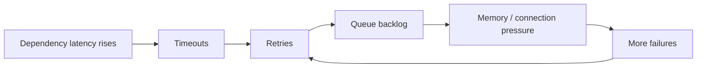

# Testing And Resilience Strategy

## 文档状态

本文定义 MemoryWeaver、RAG Evidence Layer、GBrain、ReAct Runtime、CLI Worker、
checkpoint 与缓存层的测试矩阵。当前仓库只有原型级 pytest；下列测试大部分尚未
实现。

## 测试分类

用户提出的测试应全部保留。`回归测试` 重复列出一次即可。还需要补充正确性、
安全、数据、恢复和发布门禁测试。

| 分类 | 测试类型 | 目的 |
| --- | --- | --- |
| 基础正确性 | 单元测试 | 验证函数、模型和策略规则 |
| 基础正确性 | Schema / contract 测试 | 保证 CLI、RAG、GBrain、Harness 接口兼容 |
| 基础正确性 | 集成测试 | 验证跨模块行为 |
| 基础正确性 | 端到端测试 | 验证完整用户路径 |
| 基础正确性 | 冒烟测试 | 用最小流量确认系统可用和测试脚本本身有效 |
| 基础正确性 | 回归测试 | 防止修复旧问题时重新引入缺陷 |
| 数据演进 | 迁移与向后兼容测试 | 验证旧 JSON、旧 checkpoint、旧图谱和旧索引可升级 |
| 检索质量 | Retrieval evaluation | 验证 Recall@k、MRR、nDCG、citation coverage |
| 检索质量 | 中文与混合语言测试 | 防止 whitespace tokenizer 类问题回归 |
| 记忆质量 | Anti-pollution 测试 | 防止 assistant、synthetic、raw chunk 直接成为 verified memory |
| 记忆质量 | Temporal / contradiction 测试 | 验证 stale、supersedes、冲突和 freshness |
| 图谱质量 | Graph projection 测试 | 验证 tag、alias、edge、provenance 和幂等投影 |
| 性能 | Average-load 测试 | 验证日常流量下的 SLO |
| 性能 | 压力测试 | 验证高于日常流量时的退化曲线 |
| 性能 | 峰值测试 | 验证流量突然上升时的行为 |
| 性能 | Breakpoint / 容量极限测试 | 找出系统开始失败的边界 |
| 性能 | Soak / 长稳测试 | 发现内存泄漏、连接泄漏、索引膨胀和队列积压 |
| 韧性 | 崩溃测试 | 模拟进程、worker、数据库和节点异常退出 |
| 韧性 | 内存崩溃测试 | 模拟 OOM、KV cache 压力、context overflow 和内存泄漏 |
| 韧性 | 雪崩测试 | 模拟缓存击穿、重试风暴、队列积压和依赖级联失败 |
| 韧性 | Chaos / 故障注入测试 | 在受控条件下组合故障并验证保护机制 |
| 恢复 | Checkpoint 恢复测试 | 验证 ReAct 可从最后稳定步骤恢复 |
| 恢复 | 灾备恢复测试 | 验证备份、restore、RPO、RTO 和 snapshot rollback |
| 安全 | Prompt injection 测试 | 验证用户输入与 RAG 文档中的直接、间接注入 |
| 安全 | 工具与权限测试 | 防止越权、命令注入、tenant 数据串读和 secret 泄漏 |
| 发布实验 | Offline eval | 在固定数据集上比较检索和记忆策略 |
| 发布实验 | Shadow 测试 | 新策略旁路运行，不影响用户 |
| 发布实验 | Canary 测试 | 小流量发布并自动回滚 |
| 发布实验 | A/B 测试 | 比较用户效果、成本、延迟和修正率 |
| 运维 | 可观测性测试 | 验证 metrics、trace、日志和告警真的可用 |

## “内存崩溃测试”必须拆分

“内存”在本项目里有多种含义，不能用一个测试覆盖：

| 故障 | 注入方式 | 预期行为 |
| --- | --- | --- |
| Python 进程 OOM | 限制容器 RAM 或注入大对象 | 写入 checkpoint；重启后恢复；不重复执行副作用 |
| 内存泄漏 | 长时间循环检索、写入、tool job | RSS 稳定或可解释；达到阈值后 worker recycle |
| Self-hosted LLM KV cache 压力 | 提高并发和 prompt 长度 | 拒绝、排队或降级；不拖垮整个服务 |
| Context window overflow | 构造超长 thread、tool output 和 Evidence Pack | compact、裁剪、摘要或转后台；不直接崩溃 |
| RAG / GBrain cache 膨胀 | 高基数 query 与 tenant | TTL、LRU、namespace 和容量上限生效 |
| 磁盘空间耗尽 | 限制卷空间 | 停止新写入并告警；保留读取和恢复路径 |
| JSON / checkpoint 损坏 | 截断文件、破坏记录、旧 schema | 检测损坏；隔离坏记录；从 snapshot 或 journal 恢复 |

## 组件级故障矩阵

| 组件 | 关键故障 | 必测保护 |
| --- | --- | --- |
| Harness | policy 异常、循环失控、状态错误 | contract、ActionGate、TrajectoryRegulator、checkpoint |
| RAG | dense 不可用、reranker 超时、索引切换失败 | sparse 降级、超时预算、snapshot rollback |
| GBrain | 图数据库不可用、边重复、alias 环 | tag index 降级、幂等写入、环检测 |
| LLM Gateway | 429、5xx、超时、空响应、输出截断 | 限次重试、指数退避、fallback model、circuit breaker |
| CLI Worker | 卡死、退出、权限不足、队列满 | timeout、取消、沙箱、幂等键、隔离队列 |
| ActionGate | schema 绕过、越权、危险副作用、重复动作 | 默认拒绝、用户确认、幂等、审计 |
| TrajectoryRegulator | 重复失败、停滞、预算耗尽、错误恢复 | 阈值、停止条件、safe path、checkpoint |
| Checkpoint Store | 写失败、恢复失败、并发覆盖 | journal、乐观锁、版本、restore |
| Cache | miss 风暴、旧版本命中、跨 tenant 命中 | single-flight、TTL jitter、namespace、tenant key |
| Event Journal | 重放重复、顺序错误 | append-only、sequence number、幂等 consumer |

## 雪崩测试

雪崩不是单一高流量测试。它验证局部故障是否扩散：



至少覆盖：

1. 热门 query cache 同时过期，验证 single-flight 和 TTL jitter。
2. LLM provider 返回 429，验证退避、fallback 和 per-tenant budget。
3. RAG reranker 变慢，验证超时后退回基础 fusion。
4. CLI 长任务占满 worker，验证快任务仍有独立队列。
5. GBrain 不可用，验证 tag index 与 RAG 降级路径。
6. checkpoint store 写入变慢，验证限流而不是无限堆积。
7. 大 tenant 冲击系统，验证 noisy-neighbor 隔离。

## 性能测试阶梯

参考 Grafana k6 的常见层级，从小到大执行：

| 测试 | 流量形态 | 目标 |
| --- | --- | --- |
| Smoke | 很低、数十秒到数分钟 | 验证脚本与 baseline |
| Average-load | 典型生产流量 | 验证正常 SLO |
| Stress | 高于典型流量 | 验证退化是否平滑 |
| Spike | 短时间陡增 | 验证突发流量 |
| Breakpoint | 持续增加直至失败 | 估算容量上限 |
| Soak | 典型或偏高流量持续数小时 | 验证长稳和泄漏 |

必须分开测：

- 在线查询：point get、tag lookup、local graph、RAG hybrid retrieval。
- 写入：Layer 1、Layer 2 投影、批量文档 ingest、embedding、graph writer。
- ReAct：纯回答、RAG-assisted、CLI-assisted、长任务转后台。
- 混合流量：读写并发、索引切换、snapshot 更新、tenant 混合。

## 记忆与检索回归集

维护固定 golden dataset：

| 集合 | 样本 |
| --- | --- |
| Source gate | assistant positive、synthetic HyDE、terminal verified、user preference |
| Tag gate | assistant 通过 tag 命中、alias tag、deprecated tag、跨 scope tag |
| Router | 未验证 Pattern 不可触发 fast；verified Pattern 可触发 fast |
| Heat | 编辑不增 heat；检索与 validated use 分开 |
| Chinese retrieval | 中文、英文、中英混合、错误码和包名 |
| Temporal graph | 当前事实、历史事实、superseded、validity window |
| Contradiction | SILENT、WARN、BLOCK 与用户确认 |
| RAG citations | 引用 chunk、文档版本、时间戳、官方来源优先级 |
| Checkpoint | 崩溃恢复、不重复 CLI 副作用、新会话 handoff |
| Specialist routing | L0 / L1 / L2 升级、降级、超时、冲突、EvidencePacket |

## 安全测试

Agent 系统应额外覆盖：

1. 用户 prompt injection。
2. RAG 文档中的 indirect prompt injection。
3. 恶意网页、PDF、代码注释和 tool output。
4. LLM 提议危险 CLI 命令。
5. 路径穿越、命令注入、SSRF 和 secret 泄漏。
6. tenant、project、user、thread 和 model profile 隔离。
7. 越权读取 Layer 2 memory、GBrain 节点和 checkpoint。
8. 恶意文档污染 tag、entity 和 community summary。
9. PII 保留、删除和审计流程。

原则：不可信内容可以成为 evidence 或 candidate，但不能直接改变 policy、工具权限或
verified memory。

## A/B、Shadow 与 Canary

三者用途不同：

| 方法 | 是否影响用户 | 用途 |
| --- | --- | --- |
| Offline eval | 否 | 快速淘汰明显退化的策略 |
| Shadow | 否 | 对真实流量旁路比较，不改变答案 |
| Canary | 少量用户 | 观察真实风险并支持自动回滚 |
| A/B | 部分用户 | 比较长期产品效果 |

A/B 主要比较：

- task resolution rate
- user correction rate
- repeated error rate
- retrieval usefulness
- citation quality
- fast-path hit rate
- p50 / p95 / p99 latency
- token cost
- CLI success rate
- fallback rate
- memory pollution rate
- specialist count and L0 / L1 / L2 escalation rate
- specialist conflict rate and degraded fallback rate

不要只比较回答点赞率。新策略可能更讨喜，但污染长期 memory。

## 发布门禁

### 每次提交

- 单元测试。
- schema / contract 测试。
- source gate、tag gate、Router、heat 回归。
- Markdown 与静态检查。

### 每次 Pull Request

- 全量回归。
- 集成测试。
- 最小端到端测试。
- 旧数据迁移测试。
- 冒烟性能测试。

### 每次发布

- Average-load。
- 检索 golden dataset。
- checkpoint 恢复。
- snapshot rollback。
- 安全基线。
- Canary。

### 每周或重大改动

- Stress。
- Spike。
- 雪崩测试。
- 依赖故障注入。
- tenant 隔离。

### 每月或基础设施改动

- Soak。
- Breakpoint。
- 灾备恢复演练。
- 完整 Chaos 测试。

## 测试记录模板

每个测试场景写入 test registry：

```yaml
id: resilience-cli-worker-crash-001
category: resilience
component: cli-worker
owner: runtime
risk: duplicate-side-effect
preconditions:
  - checkpoint-store-ready
injection:
  - kill-worker-after-command-start
expected:
  - job-recovers-or-fails-explicitly
  - completed-side-effect-is-not-repeated
metrics:
  - recovery_time_seconds
  - duplicate_side_effect_count
gate: release
last_run_at: null
result: not_run
```

## 建议目录

```text
tests/
  unit/
  integration/
  regression/
  contract/
  retrieval_eval/
  security/
  resilience/
  migration/
  e2e/
benchmarks/
  smoke/
  average_load/
  stress/
  spike/
  breakpoint/
  soak/
experiments/
  shadow/
  canary/
  ab/
test-registry/
  scenarios.yaml
```

## 最小实施顺序

1. 把现有 79 个 pytest 和 P0 五轮验证归档为 baseline regression。
2. 保持 source gate、tag gate、Router、heat 回归，并补中文检索测试。
3. 增加 CLI、checkpoint 和幂等恢复测试。
4. 增加最小 smoke、average-load 和 soak 脚本。
5. 增加依赖降级与雪崩测试。
6. 增加 prompt injection、tenant isolation 和数据污染测试。
7. 最后建设 shadow、canary、A/B 和灾备演练。

## 参考资料

- [Grafana k6 automated performance testing](https://grafana.com/docs/k6/latest/testing-guides/automated-performance-testing/)
- [Grafana load testing types](https://grafana.com/load-testing/types-of-load-testing/)
- [AWS Fault Injection Service](https://docs.aws.amazon.com/en_us/fis/latest/userguide/what-is.html)
- [LangGraph persistence](https://docs.langchain.com/oss/python/langgraph/persistence)
- [OWASP Top 10 for LLM Applications](https://owasp.org/www-project-top-10-for-large-language-model-applications/)
