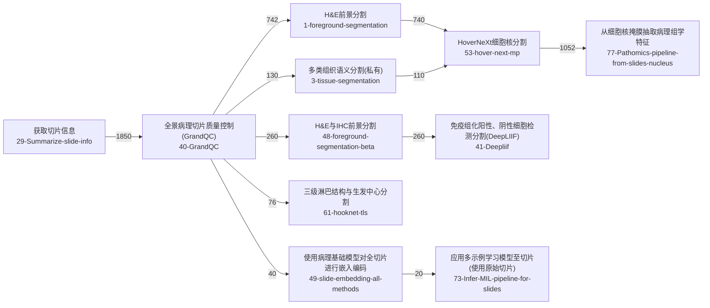

# PathoFlow Core Offline Dataset Replay

This validation replays local PathoFlow dataset bundles through PathoFlow's
offline core components. It uses `PathoFlowEngine.prepare_context()`, the
intent classifier, the knowledge base, and the retriever. It does not claim
that the live LLM answer path succeeded.

## Result

- Dataset count: 4
- Sample count: 2000
- Knowledge base: `D:\Download\PathoFlow\backups\kb\knowledge_base_aligned_before_p0_1_2026-05-02.xlsx`
- Runtime probe any-hit rate: 0.372
- Runtime probe full-hit rate: 0.09
- Canonical probe any-hit rate: 0.5755
- Canonical probe full-hit rate: 0.083
- Live ask probe success: False
- Visible internal workflow-id leaks: 0

## Live Ask Probe

- Attempted: True
- Backend: gpt-5.5
- Case id: immune_001
- Success: False
- Detail: LLM API 请求失败 (HTTP 401, model=gpt-5.5): {"error": {"code": "", "message": "Invalid token (request id: 202606141154032562720288268d9d6igyF6Fyo)", "type": "new_api_error"}}

## Boundaries

- No real WISH execution.
- No verified memory write.
- No claim that the live PathoFlow answer path is healthy when the LLM credential probe fails.
- PathoFlow-style structured outputs in this folder are deterministic audit records built from dataset labels plus PathoFlow core replay evidence.

## Best-Supported Workflow Graph

The strongest workflow spine in the local data is the chain below. It is the
most frequent exact `expected_toolchain` across all four bundles.

## Top Exact Toolchains

- 700: 获取切片信息 -> 全景病理切片质量控制(GrandQC) -> H&E前景分割 -> HoverNeXt细胞核分割 -> 从细胞核掩膜抽取病理组学特征
- 260: 获取切片信息 -> 全景病理切片质量控制(GrandQC) -> H&E与IHC前景分割 -> 免疫组化阳性、阴性细胞检测分割(DeepLIIF)
- 230: 获取切片信息 -> 全景病理切片质量控制(GrandQC)
- 200: 获取切片信息 -> 全景病理切片质量控制(GrandQC) -> HoverNeXt细胞核分割 -> 从细胞核掩膜抽取病理组学特征
- 110: 获取切片信息 -> 全景病理切片质量控制(GrandQC) -> 多类组织语义分割(私有) -> HoverNeXt细胞核分割 -> 从细胞核掩膜抽取病理组学特征
- 76: 获取切片信息 -> 全景病理切片质量控制(GrandQC) -> 三级淋巴结构与生发中心分割
- 40: 获取切片信息 -> 全景病理切片质量控制(GrandQC) -> H&E前景分割 -> HoverNeXt细胞核分割 -> 从细胞核掩膜抽取病理组学特征 -> GigaTIME-虚拟免疫荧光
- 30: 获取切片信息 -> 全景病理切片质量控制(GrandQC) -> GigaTIME-虚拟免疫荧光
- 20: 获取切片信息 -> 全景病理切片质量控制(GrandQC) -> 使用病理基础模型对全切片进行嵌入编码 -> 应用多示例学习模型至切片(使用原始切片)
- 20: 获取切片略缩图

## Dataset Recall

- Runtime pathoflow_immune_tme_500: any-hit=0.42, full-hit=0.0, avg-hit=0.1058
- Runtime pathoflow_immune_tme_p0_500: any-hit=0.368, full-hit=0.0, avg-hit=0.1265
- Runtime pathoflow_optimized_500: any-hit=0.46, full-hit=0.24, avg-hit=0.3208
- Runtime pathoflow_optimized_500_repaired: any-hit=0.24, full-hit=0.12, avg-hit=0.1658
- Canonical pathoflow_immune_tme_500: any-hit=0.68, full-hit=0.0, avg-hit=0.2633
- Canonical pathoflow_immune_tme_p0_500: any-hit=0.578, full-hit=0.0, avg-hit=0.2419
- Canonical pathoflow_optimized_500: any-hit=0.522, full-hit=0.166, avg-hit=0.2873
- Canonical pathoflow_optimized_500_repaired: any-hit=0.522, full-hit=0.166, avg-hit=0.2873

## Tool Recall

Runtime top expected-tool recall:
- 获取切片信息: expected=1870, hit=150, recall=0.0802
- 全景病理切片质量控制(GrandQC): expected=1850, hit=514, recall=0.2778
- HoverNeXt细胞核分割: expected=1072, hit=20, recall=0.0187
- 从细胞核掩膜抽取病理组学特征: expected=1052, hit=20, recall=0.019
- H&E前景分割: expected=742, hit=164, recall=0.221
- 免疫组化阳性、阴性细胞检测分割(DeepLIIF): expected=260, hit=0, recall=0.0
- H&E与IHC前景分割: expected=260, hit=20, recall=0.0769
- 多类组织语义分割(私有): expected=130, hit=0, recall=0.0
- 三级淋巴结构与生发中心分割: expected=76, hit=38, recall=0.5
- GigaTIME-虚拟免疫荧光: expected=70, hit=10, recall=0.1429

Canonical top expected-tool recall:
- 获取切片信息: expected=1870, hit=303, recall=0.162
- 全景病理切片质量控制(GrandQC): expected=1850, hit=519, recall=0.2805
- HoverNeXt细胞核分割: expected=1072, hit=115, recall=0.1073
- 从细胞核掩膜抽取病理组学特征: expected=1052, hit=115, recall=0.1093
- H&E前景分割: expected=742, hit=549, recall=0.7399
- 免疫组化阳性、阴性细胞检测分割(DeepLIIF): expected=260, hit=0, recall=0.0
- H&E与IHC前景分割: expected=260, hit=0, recall=0.0
- 多类组织语义分割(私有): expected=130, hit=0, recall=0.0
- 三级淋巴结构与生发中心分割: expected=76, hit=76, recall=1.0
- GigaTIME-虚拟免疫荧光: expected=70, hit=0, recall=0.0

## Contract Compliance

- Structured output count: 2000
- Missing required fields: 0
- Visible internal workflow-id leaks: 0
- Empty reasoning fields: 0
- Empty risks fields: 0
- Empty alternative fields: 0
- Empty follow-up question lists: 0

## Notes

- Runtime probe uses the last user turn plus previous dialogue history.
- Canonical probe uses the dataset's `resolved_user_need` when available.
- Exact PathoFlow JSON contracts are written to `pathoflow_structured_outputs.jsonl`.
- Full per-probe call logs are written to `probe_call_logs.jsonl`.
- Machine-readable compliance details are written to `contract_compliance.json`.
