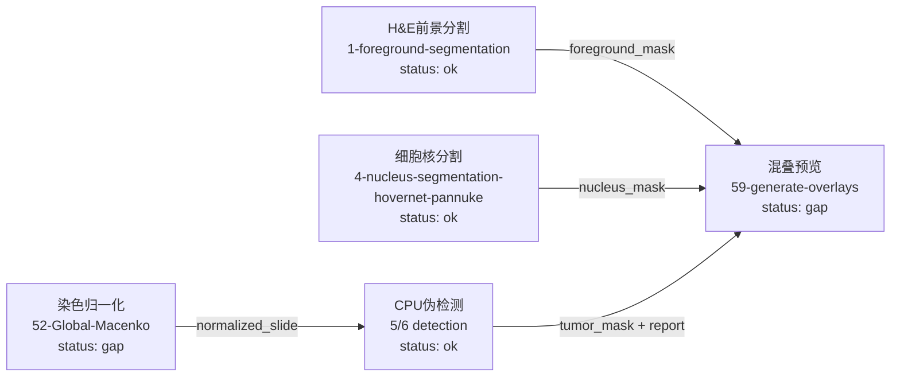

# PathoFlow Tool-Native Workflow Compare

This validation skips all LLM calls and uses PathoFlow's own non-LLM modules
to see what the repository can really do right now with tool-native flow logic.

## Result

- Planner probe count: 3
- Tool execution probe count: 6
- Previous offline replay runtime any-hit rate: 0.372
- Previous offline replay canonical any-hit rate: 0.5755

## What Was Actually Executed

- cpu_pseudo_detection_only: tool=5-pancreas-tumor-detection, mode=cpu_pseudo, success=True, file_count=3, state=completed
- demo_foreground_mask_only: tool=1-foreground-segmentation, mode=demo, success=True, file_count=1, state=completed
- demo_overlay_expected_gap: tool=59-generate-overlays, mode=demo, success=True, file_count=0, state=completed_no_output
- demo_nucleus_mask_only: tool=4-nucleus-segmentation-hovernet-pannuke, mode=demo, success=True, file_count=1, state=completed
- demo_macenko_expected_gap: tool=52-Global-Macenko, mode=demo, success=True, file_count=0, state=completed_no_output
- cpu_pseudo_breast_detection: tool=6-breast-tumor-detection, mode=cpu_pseudo, success=True, file_count=3, state=completed

## Multi-Step Attempt

- Attempt success: True
- Overlay preflight ready: True
- Overlay execution status: completed
- Overlay returned files: 0

## Multi-Step Chain Matrix

- chain_foreground_to_overlay: preflight=True, execution=completed, output_files=0
- chain_nucleus_to_overlay: preflight=True, execution=completed, output_files=0
- chain_detection_to_overlay: preflight=False, execution=completed, output_files=0
- chain_macenko_to_detection: preflight=blocked_by_empty_upstream_output, execution=blocked_by_empty_upstream_output, output_files=0

## Sequential Chain Execution

- tool_executor_foreground_overlay: success_count=2, failure_count=0, skipped_count=0
- tool_executor_nucleus_overlay: success_count=2, failure_count=0, skipped_count=0
- tool_executor_detection_overlay: success_count=2, failure_count=0, skipped_count=0
- tool_executor_macenko_detection: success_count=1, failure_count=1, skipped_count=0

## Current Executable Workflow Graph

## Planner Drift

- planner_qc_lung: query=`对肺癌NDPI批次进行信息汇总和质控，筛出不适合后续分析的低质量切片。` -> primary=`肝内胆管癌检测` (wish_14_intrahepatic_cholangiocarcinoma_cancer_detection)
- planner_tme_lung: query=`对肺癌H&E切片进行TILs/免疫浸润/TME代理分析。` -> primary=`肝内胆管癌检测` (wish_14_intrahepatic_cholangiocarcinoma_cancer_detection)
- planner_ihc_lung: query=`对肺癌IHC切片进行阳性阴性细胞定量。` -> primary=`肝内胆管癌检测` (wish_14_intrahepatic_cholangiocarcinoma_cancer_detection)

## Stage 2 Family Scope Mapping

- `model_family_scope_skill_map.md`: split `classification`, `segmentation`,
  `segmentation_multi_resolution`, and `external` by real runtime entrypoint,
  then mark each family's function boundary, I/O shape, and current local
  validation state.
- `model_family_scope_skill_map.json`: machine-readable family map and
  skill-composition blocks for later harness or skill packaging work.
- `model_family_skill_workflow.mmd`: family-level workflow graph for skill
  assembly.

## Stage 3 Skill Catalog

- `pathoflow_skill_catalog.md`: concrete PathoFlow skill catalog with purpose,
  sequence, input/output contract, readiness level, auto-scheduling policy, and
  current blockers.
- `pathoflow_skill_catalog.json`: machine-readable catalog for later harness or
  deterministic scheduler integration.
- `pathoflow_skill_catalog.mmd`: skill-level workflow graph with readiness and
  broken helper nodes.

## Comparison With Previous Workflow

- 上一版主要是 prepare_context / retriever 回放，缺少真正的工具执行结果目录与 manifest。
- PathoFlow 自带 OfflineFlowPlanner 在代表性查询上离线主选严重漂移，连续把肺癌/免疫/TME/IHC查询都选成了肝内胆管癌检测。
- PathoFlow 的 demo overlay 工具当前会 success=true 但 file_count=0，说明工具链可视化末端存在资源或打包缺口。
- CPU_PSEUDO 和 DEMO 执行器可以产出真实 result_manifest，这证明无 LLM 时仍能走一条工具驱动的流程，但覆盖范围明显小于上一版理论工具链。
- 当前可执行链更像多个单步工具的可运行片段，还不是 PathoFlow 自己稳定串好的多步病理工作流。
- 上一版 workflow 里大量工具来自数据集标注主链，而不是 PathoFlow 当前无 LLM planner 自己稳定规划出来的链路；两者不能等价看待。

## Bottom Line

上一版不是“完全没结果”，但它的结果主要是离线检索/规则回放结果，不是 PathoFlow 当前仓库在无 LLM 条件下自己完整规划并稳定执行出来的全流程。
这次的新证据说明：PathoFlow 现在确实能在无 LLM 时跑出部分真工具结果与 manifest，但 planner 质量、demo 资源完整性，以及多步链路闭环能力都存在明显问题。
