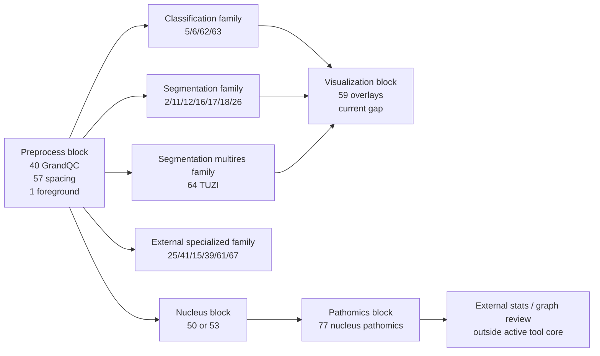

# PathoFlow Model Family Scope And Skill Map

## Purpose

This note is the Stage 2 split requested for PathoFlow's core model families.
It does not try to adapt or rewrite the framework. It keeps PathoFlow's current
registry and execution boundaries, then marks:

- which family each core model really belongs to at runtime,
- what problem each family is good at,
- what each family should not be asked to do,
- what upstream and downstream blocks it combines with,
- and which parts are already locally validated versus only registry-declared.

## Evidence Basis

- Runtime comparison:
  `docs/validation/pathoflow-tool-native-workflow-compare-2026-06-14/comparison.json`
- Sequential chain results:
  `docs/validation/pathoflow-tool-native-workflow-compare-2026-06-14/sequential_chains.json`
- Reviewed flow registry YAMLs under:
  `D:\Download\PathoFlow\flow_registry\data\flows\wish_reviewed\`
- Wrapper/core YAMLs under:
  `D:\Download\PathoFlow\flow_registry\data\flows\wrapper\`
  `D:\Download\PathoFlow\flow_registry\data\flows\core\`

## Split Principle

This split is based on runtime entrypoints, not only on tool names.

- `classification`: tools routed through `scripts.classification_mp_apply.construct_cmd`
  or `pinglib.classification.apps.apply`
- `segmentation`: tools routed through `scripts.segmentation_mp_apply.construct_cmd`
  or `pinglib.segmentation.apps.apply`
- `segmentation_multi_resolution`: tools routed through
  `scripts.segmentation_multires_mp_apply.construct_cmd`
- `external`: tools routed through `pinglib.external.*` or `scripts.externals.*`

Because PathoFlow's reviewed workflow layer already separates some nucleus and
pathomics chains out of those four families, this note also adds a
cross-family block section at the end. That part is important if we later turn
these blocks into reusable skills.

## Family Overview

- `classification`
  Role: slide-level tumor detection, coarse localization, heatmap scoring,
  disease-specific or pan-cancer screening.
  Best output shape: heatmap, score JSON, prediction tables.
  Bad fit: exact pixel boundary work, nucleus geometry, direct graph analytics.

- `segmentation`
  Role: region or tissue mask generation aligned to the slide coordinate system.
  Best output shape: binary or multi-class TIF/TIFF masks.
  Bad fit: slide-level diagnosis ranking, modality synthesis.

- `segmentation_multi_resolution`
  Role: multi-scale tissue segmentation where single-resolution masks are not
  enough.
  Best output shape: WSI-aligned mask plus optional overlay or region JSON.
  Bad fit: whole-slide classification and non-mask downstream tasks.

- `external`
  Role: specialized adapters that do not naturally fit the main classification
  or segmentation wrappers.
  Best output shape: task-specific; can be masks, QC reports, cell tables, or
  generated images.
  Bad fit: treating all external tools as interchangeable; this family is a
  transport bucket, not one semantic task family.

## 1. Classification Family

### Runtime Boundary

- Shared wrapper:
  `flow_registry/data/flows/wrapper/classification_construct_cmd.yaml`
- Main entrypoints:
  `scripts.classification_mp_apply.construct_cmd`
  `pinglib.classification.apps.apply`

### Representative Core Models

- `5-pancreas-tumor-detection`
  Source flow: `wish_5_pancreas_tumor_detection`
  Role: disease-specific pancreatic tumor heatmap and report output.
- `6-breast-tumor-detection`
  Source flow: `wish_6_breast_tumor_detection`
  Role: disease-specific breast tumor heatmap and report output.
- `62-pancancer-detection-20`
  Source flow: `wish_62_pancancer_detection_20`
  Role: pan-cancer detection at 2.0 um/px.
- `63-pancancer-detection-40`
  Source flow: `wish_63_pancancer_detection_40`
  Role: pan-cancer detection at 4.0 um/px.

### Functional Scope

- Good at:
  coarse suspicious-region screening,
  slide-level tumor probability mapping,
  heatmap-style decision support,
  structured prediction export.
- Not the right family for:
  exact mask boundaries,
  nucleus instance maps,
  graph-ready cell coordinates,
  direct stain transfer or virtual modality generation.

### I/O Shape

- Typical input:
  `input_slide`
- Typical registry outputs:
  `heatmap_tif`, `overlay_png`, `score_json`
- Current local execution evidence:
  cpu-pseudo detection produced `detection_result.png`, `tumor_mask.png`,
  `report.json`

### Upstream And Downstream Role

- Good upstream blocks:
  `40-GrandQC` for slide quality filtering,
  `1-foreground-segmentation` for tissue restriction,
  `52-Global-Macenko` as a theoretical normalization step.
- Good downstream blocks:
  `59-generate-overlays` if the result mask contract is normalized to
  `mask_tif`.

### Current Local Validation Status

- Verified locally:
  `5-pancreas-tumor-detection` in `cpu_pseudo` returned 3 output files.
  `6-breast-tumor-detection` in `cpu_pseudo` returned 3 output files.
- Current boundary failure:
  `classification -> overlay` is not safely composable yet because the local
  detection result mask is currently `.png`, while the overlay preflight
  contract expects `.tif/.tiff`.

### Skill Packaging Suggestion

- `skill_classification_screening`
  Recommended block order:
  `40-GrandQC? -> 1-foreground-segmentation? -> 5|6|62|63 -> 59?`
- Boundary note:
  this skill should be framed as slide-level screening or heatmap generation,
  not as segmentation or cell analysis.

## 2. Segmentation Family

### Runtime Boundary

- Main entrypoints:
  `pinglib.segmentation.apps.apply`
  `scripts.segmentation_mp_apply.construct_cmd`

### Representative Core Models

- `1-foreground-segmentation`
  Source flow: `wish_1_foreground_segmentation`
  Role: support flow for valid tissue mask generation.
- `2-lung-cancer-segmentation`
  Source flow: `wish_2_lung_cancer_segmentation`
  Role: disease-region mask generation.
- `11-CD34-vessel-segmentation`
  Source flow: `wish_11_cd34_vessel_segmentation`
  Role: vessel mask extraction.
- `12-PAS-kidney-glomeruli-segmentation`
  Source flow: `wish_12_pas_kidney_glomeruli_segmentation`
  Role: glomeruli mask extraction.
- `18-PAS-kidney-glomeruli-multi-class-segmentation`
  Source flow: `wish_18_pas_kidney_glomeruli_multi_class_segmentation`
  Role: multi-class glomeruli segmentation.
- `26-Kidney-Masson-4-class-segmentation`
  Source flow: `wish_26_kidney_masson_4_class_segmentation`
  Role: multi-class renal tissue segmentation.

### Functional Scope

- Good at:
  WSI-aligned binary or multi-class mask generation,
  ROI restriction,
  pathology structure segmentation,
  downstream handoff into visualization or mask-based post-processing.
- Not the right family for:
  slide-level heatmap-only classification,
  virtual staining,
  pure feature-table export without a mask stage.

### I/O Shape

- Typical input:
  `input_slide`
- Typical registry outputs:
  `mask_tif`, optional `overlay_png`, optional `region_json`

### Upstream And Downstream Role

- Good upstream blocks:
  `40-GrandQC`,
  `57-estimate-image-spacing` when spacing is uncertain and input is a normal
  image,
  `52-Global-Macenko` when normalization is explicitly required.
- Good downstream blocks:
  `59-generate-overlays`,
  mask-based feature extraction or reviewed composite pipelines.

### Current Local Validation Status

- Verified locally:
  `1-foreground-segmentation` in `demo` returned one foreground TIF.
  Legacy `4-nucleus-segmentation-hovernet-pannuke` in `demo` returned one
  nucleus-map TIF, which proves a nucleus-mask branch can still execute in the
  current repository.
- Current boundary failure:
  `1-foreground-segmentation -> 59-generate-overlays` passes preflight, but
  overlay execution currently returns `completed_no_output`.
- Registry-only on this pass:
  most disease-specific region-segmentation flows were not directly executed in
  this local run even though they are reviewed in the registry.

### Skill Packaging Suggestion

- `skill_region_segmentation`
  Recommended block order:
  `40-GrandQC? -> 1-foreground-segmentation? -> 2|11|12|16|17|18|26 -> 59`
- Boundary note:
  this skill should promise masks first. Anything that needs a diagnosis label,
  cohort score, or attention heatmap belongs back in classification.

## 3. Segmentation Multi Resolution Family

### Runtime Boundary

- Main entrypoint:
  `scripts.segmentation_multires_mp_apply.construct_cmd`

### Representative Core Model

- `64-TUZI`
  Source flow: `wish_64_tuzi`
  Role: general-purpose multi-resolution tissue segmentation base model.

### Functional Scope

- Good at:
  coarse-to-fine tissue mask generation,
  situations where single-scale segmentation is likely too brittle,
  building a stronger prior mask before downstream analysis.
- Not the right family for:
  direct classification,
  direct cell graph construction,
  modality generation,
  report-only workflows without masks.

### I/O Shape

- Typical input:
  `input_slide`
- Typical registry outputs:
  `mask_tif`, optional `overlay_png`, optional `region_json`

### Upstream And Downstream Role

- Good upstream blocks:
  `40-GrandQC`,
  `57-estimate-image-spacing` if the slide resolution is uncertain.
- Good downstream blocks:
  `59-generate-overlays`,
  any downstream process that only needs a tissue prior mask.

### Current Local Validation Status

- Registry reviewed:
  `64-TUZI` is clearly registered and mapped to the multi-resolution wrapper.
- Not locally executed in this pass:
  there is no matching manifest evidence in the current validation folder.

### Skill Packaging Suggestion

- `skill_multires_tissue_prior`
  Recommended block order:
  `40-GrandQC? -> 57-estimate-image-spacing? -> 64-TUZI -> 59?`
- Boundary note:
  this family is currently narrow. In the current repository it behaves more
  like a specialized segmentation branch than a broad ecosystem.

## 4. External Family

### Runtime Boundary

- Main entrypoints:
  `pinglib.external.*`
  `scripts.externals.*`

### Key Core Models And Subclusters

- QC and calibration:
  `40-GrandQC`
  `57-estimate-image-spacing`
- Prompt or foundation-style segmentation:
  `25-BiomedParse`
- IHC and cell quantification:
  `41-DeepLIIF`
- Multi-function morphology:
  `15-Cerberus`
- Niche segmentation or classification adapters:
  `16-liver-tissue-segmentation`
  `51-ssl-luad-classification`
  `61-hooknet-tls`
- Modality generation or stain transfer:
  `39-HE-transfer-to-SHG`
  `67-GigaTIME`

### Functional Scope

- Good at:
  special tasks that do not fit the main WISH classification or segmentation
  wrappers,
  QC adapters,
  IHC positive/negative cell analysis,
  prompt-based segmentation,
  generated-image or virtual-modality workflows,
  specialized external open-source models.
- Not the right family for:
  assuming one shared contract,
  replacing the main classification or segmentation families wholesale,
  planner shortcuts that ignore per-tool artifact semantics.

### I/O Shape

- `40-GrandQC`
  output emphasis: QC label directory and QC JSON
- `41-DeepLIIF`
  output emphasis: cell mask and optional count CSV
- `25-BiomedParse`
  output emphasis: prompt-driven mask
- `39-HE-transfer-to-SHG`
  output emphasis: generated grayscale image
- `67-GigaTIME`
  output emphasis: generated multi-channel image set
- `61-hooknet-tls`
  output emphasis: mask plus optional overlay/report

### Upstream And Downstream Role

- Use `40-GrandQC` before expensive downstream work when slide quality is
  uncertain.
- Use `57-estimate-image-spacing` only in the special case where a normal image
  lacks trusted physical spacing.
- Use `41-DeepLIIF` as a self-contained IHC quantification skill, not as a
  generic segmentation primitive.
- Use `25-BiomedParse` when the user asks for prompt-based segmentation, not
  when a disease-specific reviewed segmentation model already exists.
- Use `39-HE-transfer-to-SHG` and `67-GigaTIME` as image-generation skills.
  Their outputs are generated images, not masks for normal overlay chains.

### Current Local Validation Status

- Registry reviewed but not locally executed in this pass:
  `40`, `41`, `25`, `15`, `16`, `39`, `57`, `61`, `67`, `51`
- Practical warning from adjacent support wrappers:
  `52-Global-Macenko` currently returns `completed_no_output`, which is a good
  reminder that not every declared preprocessing or external-style adapter is
  execution-complete right now.

### Skill Packaging Suggestion

- `skill_ihc_quantification`
  `40-GrandQC? -> 41-DeepLIIF`
- `skill_prompt_segmentation`
  `25-BiomedParse -> 59?`
- `skill_virtual_modality`
  `39-HE-transfer-to-SHG` or `67-GigaTIME`
- `skill_specialized_tls`
  `40-GrandQC? -> 61-hooknet-tls -> external review or overlay`

## Cross Family Blocks Needed For Reusable Skills

These blocks matter because PathoFlow's reviewed composite workflows already
build on them, even though they sit partly outside the four requested runtime
families.

### Nucleus And Pathomics Block

- Preferred reviewed nucleus segmentation:
  `50-hovernet-pannuke-mp` or `53-hover-next-mp`
- Downstream composite:
  `77-Pathomics-pipeline-from-slides-nucleus`
- Evidence:
  `workflow_foreground_nucleus_pathomics_survival.yaml`
  `workflow_nucleus_graph_visualization.yaml`

Scope:

- Good at:
  nucleus instance extraction, nucleus-aware pathomics features,
  graph-ready downstream exports.
- Not good at:
  replacing classification,
  pretending that nucleus features are clinically ready without aggregation and
  patient-level review.

Current local nuance:

- The reviewed workflow layer prefers `50` and `53`.
- The current local execution proof is stronger for legacy `4` in demo mode.
- So if we turn this into a skill, the skill should prefer `50/53` at the
  registry layer but keep a note that local execution proof in this pass came
  from legacy `4`.

### Visualization Block

- Tool:
  `59-generate-overlays`

Scope:

- Good at:
  turning a slide plus a TIF/TIFF mask into a human-readable overlay preview.
- Current problem:
  preflight often succeeds, but local demo execution currently returns zero
  output files.

### Normalization Block

- Tool:
  `52-Global-Macenko`

Scope:

- Intended role:
  stain normalization before downstream classification or segmentation.
- Current problem:
  local demo execution returns `completed_no_output`, so this block should be
  treated as declared-but-fragile in any skill graph.

## Skill Atoms To Keep

- `skill_preprocess_qc_mask`
  `40-GrandQC? -> 57-estimate-image-spacing? -> 1-foreground-segmentation`
- `skill_classification_screening`
  `skill_preprocess_qc_mask -> 5|6|62|63 -> 59?`
- `skill_region_segmentation`
  `skill_preprocess_qc_mask -> 2|11|12|16|17|18|26 -> 59`
- `skill_multires_tissue_prior`
  `40-GrandQC? -> 57-estimate-image-spacing? -> 64-TUZI -> 59?`
- `skill_nucleus_pathomics`
  `1-foreground-segmentation? -> 50|53 -> 77`
- `skill_ihc_quantification`
  `40-GrandQC? -> 41-DeepLIIF`
- `skill_prompt_segmentation`
  `25-BiomedParse -> 59?`
- `skill_virtual_modality`
  `39-HE-transfer-to-SHG` or `67-GigaTIME`

## Combination Risks That Matter Right Now

- `classification -> 59-generate-overlays`
  Current issue: mask contract mismatch, because local detection artifacts are
  `.png` while overlay expects `.tif/.tiff`.
- `1-foreground-segmentation -> 59-generate-overlays`
  Current issue: preflight is ready, but overlay returns zero output files.
- `4-nucleus-segmentation-hovernet-pannuke -> 59-generate-overlays`
  Current issue: same zero-output overlay failure.
- `52-Global-Macenko -> downstream model`
  Current issue: normalization returns no artifact, so downstream chaining
  breaks immediately.
- `OfflineFlowPlanner`
  Current issue: planner drift is severe enough that skill composition should
  not trust its current primary-tool choice without deterministic guards.

## Mermaid Family Workflow

## Bottom Line

If we are packaging PathoFlow into reusable skills without changing the
framework, the cleanest split is:

- `classification` for heatmap and score style screening,
- `segmentation` for region masks,
- `segmentation_multi_resolution` for stronger tissue-prior masks,
- `external` for specialized adapters that must stay task-specific,
- plus one explicit cross-family `nucleus -> pathomics` block.

The main engineering limits are not the family split itself. The real blockers
for skill composition right now are overlay output loss, normalization output
loss, and planner drift.
