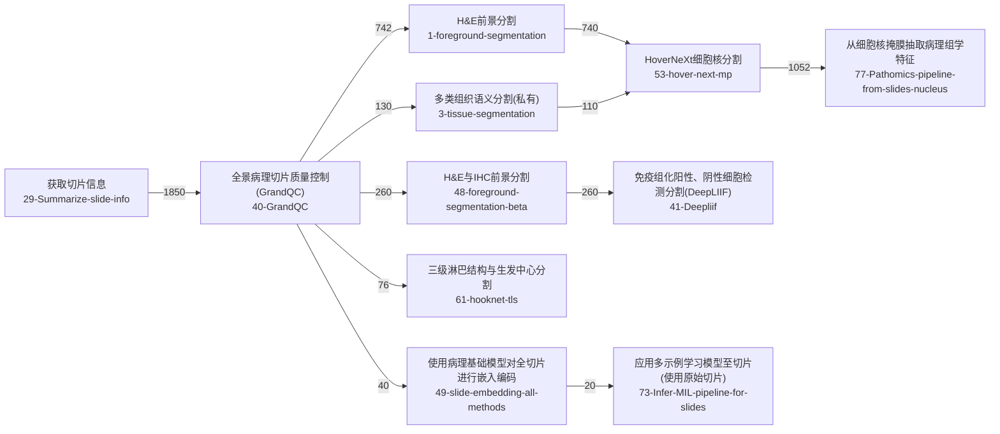
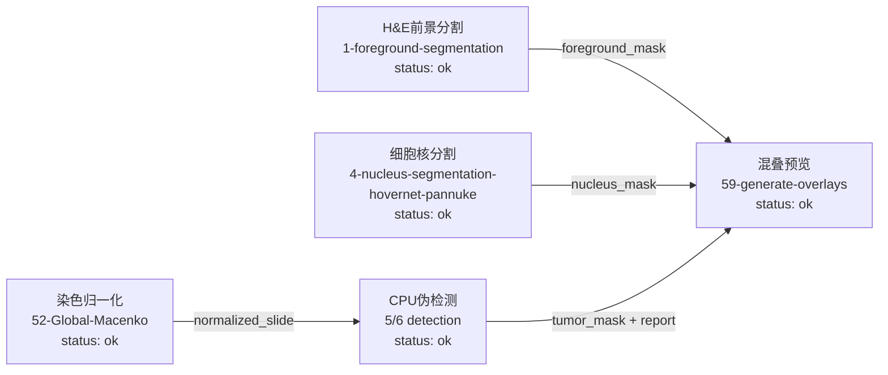

# PathoFlow Workflow Contrast Report

This report contrasts the theoretical workflow recovered from the offline
PathoFlow replay package with the currently executable no-LLM workflow
evidence from the tool-native package.

## Theoretical Workflow

Theoretical workflow is derived from the offline baseline's dominant exact
`expected_toolchain` patterns.

- 700: 29-Summarize-slide-info -> 40-GrandQC -> 1-foreground-segmentation -> 53-hover-next-mp -> 77-Pathomics-pipeline-from-slides-nucleus
- 260: 29-Summarize-slide-info -> 40-GrandQC -> 48-foreground-segmentation-beta -> 41-Deepliif
- 230: 29-Summarize-slide-info -> 40-GrandQC
- 200: 29-Summarize-slide-info -> 40-GrandQC -> 53-hover-next-mp -> 77-Pathomics-pipeline-from-slides-nucleus
- 110: 29-Summarize-slide-info -> 40-GrandQC -> 3-tissue-segmentation -> 53-hover-next-mp -> 77-Pathomics-pipeline-from-slides-nucleus

## Actually Executable Workflow

Executable workflow is limited to no-LLM demo / cpu_pseudo tools that
currently return real manifests and files.

- H&E前景分割: status=ok, outputs=foreground_mask
- 细胞核分割: status=ok, outputs=nucleus_mask
- CPU伪检测: status=ok, outputs=detection_result, tumor_mask, report_json
- 混叠预览: status=ok, outputs=overlay_png
- 染色归一化: status=ok, outputs=normalized_slide

## Main Gaps

- Previous offline replay runtime any-hit rate: 0.372
- Previous offline replay canonical any-hit rate: 0.5755
- Planner primary drift counts: {'wish_40_grandqc': 1, 'workflow_foreground_nucleus_pathomics_survival': 1, 'wish_41_deepliif': 1}
- Executed zero-output cases: []

## Breakpoint Summary

- sequential_chain_failure: 2

## Interpretation

- Theoretical PathoFlow workflow is much richer than the currently executable workflow.
- The biggest practical breakpoints are planner drift, downstream overlay empty outputs, empty normalization outputs, and format-contract mismatch between upstream and downstream tools.
- The repository can execute some real no-LLM tool fragments, but it cannot yet turn the recovered theoretical workflow into a stable multi-step closed loop.
