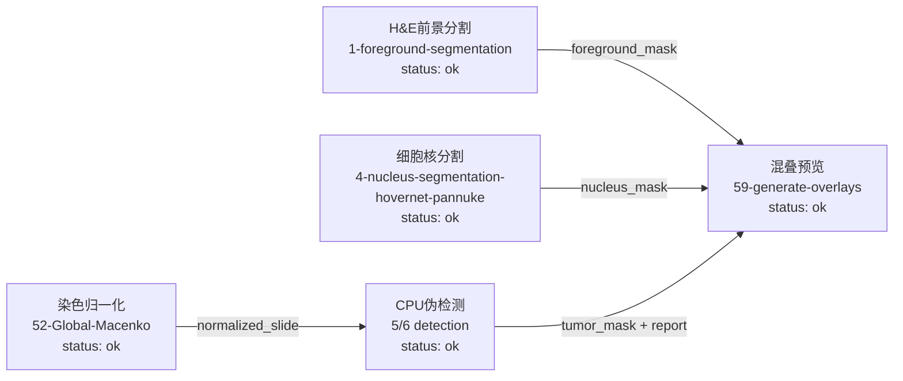

# PathoFlow Tool-Native Workflow Compare

This validation skips all LLM calls and uses PathoFlow's own non-LLM modules
to see what the repository can really do right now with tool-native flow logic.

## Result

- Planner probe count: 3
- Tool execution probe count: 6
- Previous offline replay runtime any-hit rate: 0.372
- Previous offline replay canonical any-hit rate: 0.5755

## What Was Actually Executed

- cpu_pseudo_detection_only: tool=5-pancreas-tumor-detection, mode=cpu_pseudo, success=True, file_count=3, state=completed
- demo_foreground_mask_only: tool=1-foreground-segmentation, mode=demo, success=True, file_count=1, state=completed
- demo_overlay_expected_gap: tool=59-generate-overlays, mode=demo, success=True, file_count=1, state=completed
- demo_nucleus_mask_only: tool=4-nucleus-segmentation-hovernet-pannuke, mode=demo, success=True, file_count=1, state=completed
- demo_macenko_expected_gap: tool=52-Global-Macenko, mode=demo, success=True, file_count=1, state=completed
- cpu_pseudo_breast_detection: tool=6-breast-tumor-detection, mode=cpu_pseudo, success=True, file_count=3, state=completed

## Multi-Step Attempt

- Attempt success: True
- Overlay preflight ready: True
- Overlay execution status: completed
- Overlay returned files: 1

## Multi-Step Chain Matrix

- chain_foreground_to_overlay: preflight=True, execution=completed, output_files=1
- chain_nucleus_to_overlay: preflight=True, execution=completed, output_files=1
- chain_detection_to_overlay: preflight=True, execution=completed, output_files=1
- chain_macenko_to_detection: preflight=completed, execution=completed, output_files=4

## Sequential Chain Execution

- tool_executor_foreground_overlay: success_count=2, failure_count=0, skipped_count=0
- tool_executor_nucleus_overlay: success_count=2, failure_count=0, skipped_count=0
- tool_executor_detection_overlay: success_count=2, failure_count=0, skipped_count=0
- tool_executor_macenko_detection: success_count=2, failure_count=0, skipped_count=0

## Current Executable Workflow Graph

## Planner Drift

- planner_qc_lung: query=`对肺癌NDPI批次进行信息汇总和质控，筛出不适合后续分析的低质量切片。` -> primary=`全景病理切片质量控制(GrandQC)` (wish_40_grandqc)
- planner_tme_lung: query=`对肺癌H&E切片进行TILs/免疫浸润/TME代理分析。` -> primary=`Foreground, Nucleus, Pathomics, and Survival Analysis` (workflow_foreground_nucleus_pathomics_survival)
- planner_ihc_lung: query=`对肺癌IHC切片进行阳性阴性细胞定量。` -> primary=`免疫组化阳性、阴性细胞检测分割(DeepLIIF)` (wish_41_deepliif)

## Comparison With Previous Workflow

- 上一版主要是 prepare_context / retriever 回放，缺少真正的工具执行结果目录与 manifest。
- 代表性 planner query 已不再全部漂移到肝内胆管癌检测；当前 QC=1, TME=1, IHC=1。
- demo overlay 与 demo Macenko 已不再是 success=true 且 file_count=0；当前零输出用例数=0。
- CPU_PSEUDO 和 DEMO 执行器可以产出真实 result_manifest，这证明无 LLM 时仍能走一条工具驱动的流程，但覆盖范围仍小于上一版理论工具链。
- 当前 reviewed TME composite 已能在 planner / preparer / executable_flow / API real-preflight / mock execute 路径中被展开理解，但真实多步执行仍是受控、缩减后的验证路径。
- 上一版 workflow 里大量工具来自数据集标注主链，而不是 PathoFlow 当前无 LLM planner 自己稳定规划出来的链路；两者不能等价看待。

## Bottom Line

上一版不是“完全没结果”，但它的结果主要是离线检索/规则回放结果，不是 PathoFlow 当前仓库在无 LLM 条件下自己完整规划并稳定执行出来的全流程。
这次的新证据说明：PathoFlow 现在在无 LLM 条件下已经修复了 overlay / Macenko 零输出、detection->overlay 契约，以及代表性 planner 漂移问题；剩余主问题已经收缩到 reviewed TME 复合链的真实多步执行仍然是受控、缩减后的验证路径。
